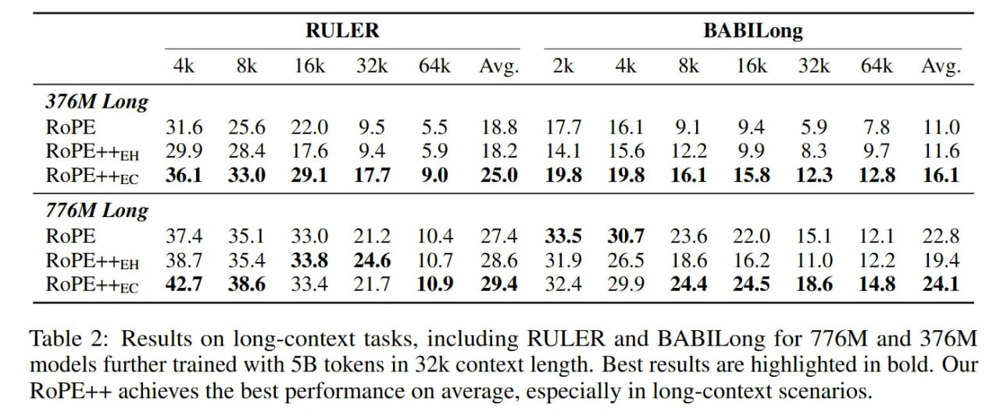

# Image Description

**File:** img_1769229448_aqadvxnrg9oryut_table_2_results_on_long_context_tasks.jpg
**Original:** image.jpg
**Received:** 1769229448

## Extracted Text (OCR)

Table 2: Results on long-context tasks, including RULER and BABILong for 776M and 376M models further trained with 5B tokens ш 32k context length. Best results are highlighted in bold. Our RoPE++ achieves the best performance on average, especially in long-context scenarios.

|                                                                       | BABILong   | BABILong                                       | BABILong   | BABILong   | BABILong   | BABILong   | BABILong   |
|-----------------------------------------------------------------------|------------|------------------------------------------------|------------|------------|------------|------------|------------|
|                                                                       |            | 16k 32k 64k Avg. 2k 4k SK 16k 32k £64k -~ Avg. |            |            |            |            |            |
| 3/6M Long                                                             |            |                                                |            |            |            |            |            |
| RoPE++eyp 29.9 28.4 17.6 94 #59 18.2 14.1 15.6 122 99 353 9/ 11.6     |            |                                                |            |            |            |            |            |
| RoPE++rc 36.1 330 29.1 177 90 $25.0 19.38 1053 16.1 158 123 12.5 161  |            |                                                |            |            |            |            |            |
| //6M Long                                                             |            |                                                |            |            |            |            |            |
| RoPE S74 35| 330 7217 Tos 774 335 307 736 220 151 171 72%             |            |                                                |            |            |            |            |            |
| RoPE++ru 387 354 33.8 24.6 107 28.6 39 265 18.6 162 110 122 194       |            |                                                |            |            |            |            |            |
| КоРЕ++.с 42.7 38.6 33.4 21.7 109 29.4 324 299 24.4 245 18.6 14.8 24.1 |            |                                                |            |            |            |            |            |

## Usage Instructions

When referencing this image in markdown:
1. Use relative path based on file location
2. Add descriptive alt text based on OCR content above
3. Add text description BELOW the image for GitHub rendering

Example:
```markdown
 <!-- TODO: Broken image path -->

**Image shows:** [Describe what the image contains based on OCR]
```
