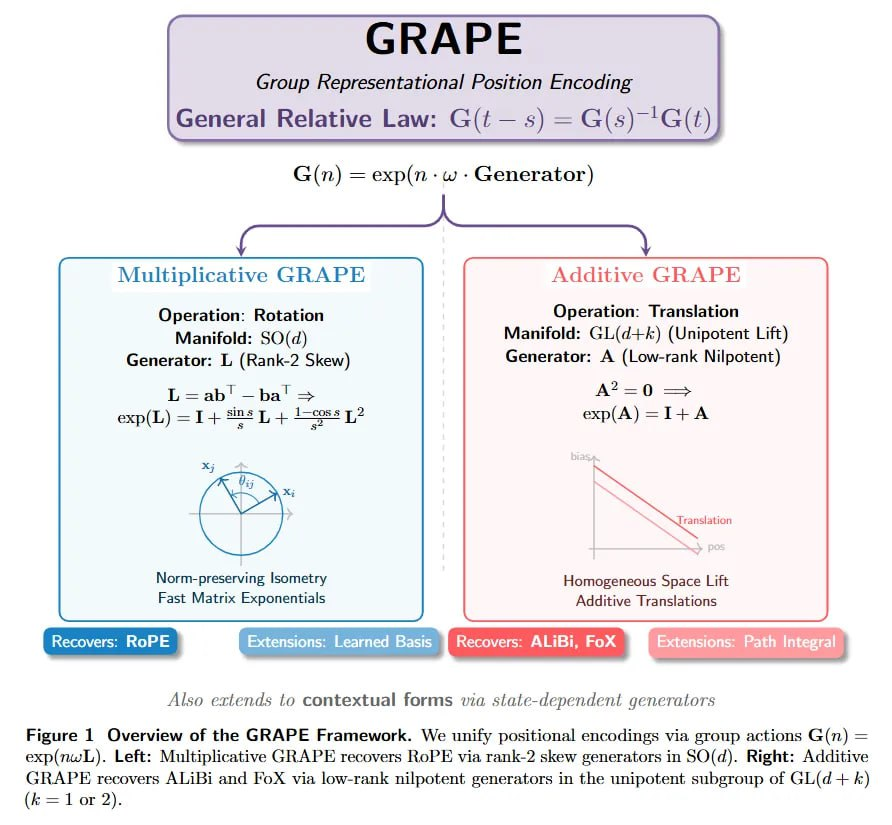

# Image Description

**File:** img_1769229465_aqadew5rg9oraut_general_relative_law_s.jpg
**Original:** image.jpg
**Received:** 1769229465

## Extracted Text (OCR)

General Relative Law: С — s) = G(s)7'G(t)

Operation: Rotation

Manifold: SO(d)

Generator: Г (Rank-2 Skew)

<!-- image -->

Manifold: GL(d+é) (Unipotent Lift)

Generator: A (Low-rank Nilpotent)

Atso exlends to contextual forms via state-dependent generators

Figure 1 Overview of the GRAPE Framework. We unity positional encodings via group actions G(n) = exp(nivL). Left: Multiplicative GRAPE recovers ВоРЕ via rank-2 skew generators ш SO(d). Right: Additive GRAPE recovers ALIBi and FoX via low-rank nilpotent fenerators in the unipotent subgroup of GL(d-+ К) (Е = 1 or 2).

## Usage Instructions

When referencing this image in markdown:
1. Use relative path based on file location
2. Add descriptive alt text based on OCR content above
3. Add text description BELOW the image for GitHub rendering

Example:
```markdown
 <!-- TODO: Broken image path -->

**Image shows:** [Describe what the image contains based on OCR]
```
