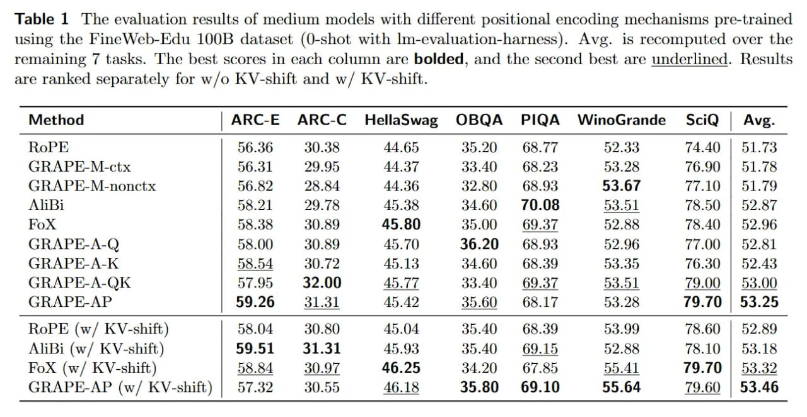

# Image Description

**File:** img_1769229465_aqadgg5rg9oraut_table_1_the_evaluation_results_of.jpg
**Original:** image.jpg
**Received:** 1769229465

## Extracted Text (OCR)

Table 1 'The evaluation results of medium models with different. positional encoding mechanisms pre-trained using the FineWeb-Edu 10056 dataset (O-shot with lm-evaluation-harness). Avg. is recomputed over the remaining 7 tasks. 'The best scores in each column are bolded, and the second best are underlined. Results are ranked separately for w/o KV-shift and w/ KV-shift.

|                                                                            |                                                            | Method | ARC-E ARC-C HellaSwag OBQA PIQA WinoGrande SciQ | Avg.   |
|----------------------------------------------------------------------------|------------------------------------------------------------|-------------------------------------------------------------------|
|                                                                            | 74.49 | 51.73                                              |                                                                   |
| (JSRAPE-M-ctx | 56.31 29 95 44 37 33.40 6323 53.98 76.90 | 51.78           |                                                            |                                                                   |
| (JRAPF-M-nonctx | 56.82 25 RA 44 36 3280 6393 53 67 7 1015179              |                                                            |                                                                   |
|                                                                            | | 58.2] IQ 78 45.38 3460 70.08 535] 78.50 | 5237           |                                                                   |
|                                                                            | Кох | 58.38 30.89 45.80 35.00 £69.37 52. S88 78.40 | 52.96 |                                                                   |
| GRAPE-A-Q | 28.00 30.89 45.70 36.20 68.93 52.96 77.00 | 52.81              |                                                            |                                                                   |
| GRAPE-A-K | 58.54 30.72 45.13 34.60 68.39 53.35 76.30 | 52.43              |                                                            |                                                                   |
| GRAPE-A-QK | 07.95 32.00 45.77 33.40 69.37 53.01 79.00 | 53.00             |                                                            |                                                                   |
| СВАРЕ-АР | 59.26 31.31 45.42 35.60 68.17 53.28 19.70 | 53.25               |                                                            |                                                                   |
| RoPE (w/ KV-shift) | 58.04 30.80 45.04 35.40 68.39 53.99 78.60 | 52.89     |                                                            |                                                                   |
| АПВ: (w/ KV-shift) | 59.51 31.35] 45.93 35.40 69.15 52.88 78.10 | 53.18    |                                                            |                                                                   |
| / К 6 .85 < Al | р. tha 2  oe | я                                          |                                                            |                                                                   |
| GRAPE-AP (w/ KV-shift) | 57.32 30.55 46.18 35.80 69.10 55.64 79.60 | 53.46 |                                                            |                                                                   |

## Usage Instructions

When referencing this image in markdown:
1. Use relative path based on file location
2. Add descriptive alt text based on OCR content above
3. Add text description BELOW the image for GitHub rendering

Example:
```markdown
 <!-- TODO: Broken image path -->

**Image shows:** [Describe what the image contains based on OCR]
```
