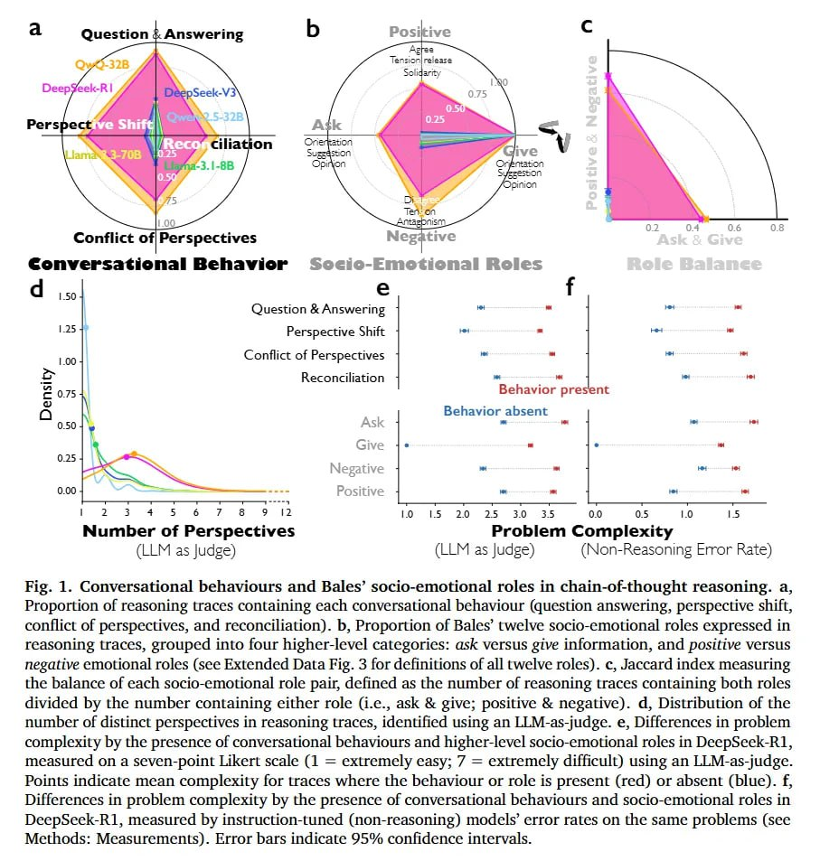

# Image Description

**File:** img_1769229550_aqadrbfrg3g6eet_fig_1_conversational_behaviours_and_bale.jpg
**Original:** image.jpg
**Received:** 1769229550

## Extracted Text (OCR)

Fig. 1. Conversational behaviours and Bales' socio-emotional roles in chain-of-thought reasoning. a, Proportion of reasoning traces containing each conversational behaviour (question answering, perspective shift, contlict of perspectives, and reconciliation). b, Proportion of Bales' twelve socio-emotional roles expressed in reasoning traces, grouped into four higher-level categories: ask versus give information, and positive versus negative emotional roles (see Extended Data Fig. 3 for definitions of all twelve roles). c, Jaccard index measuring the balance of each socio-emotional role pair, defined as the number of reasoning traces containing both roles divided by the number containing either role (1.е., ask &amp; give; positive &amp; negative). а, Distribution of the number of distinct perspectives in reasoning traces, identified using an LLM-as-judge. e, Differences in problem complexity by the presence of conversational behaviours and higher-level socio-emotional roles in DeepSeek-R1, measured on a seven-point Likert scale (1 = extremely easy; 7 = extremely difficult) using an LLM-as-judge. Points Indicate mean complexity for traces where the behaviour or role 1$ present (red) or absent (blue). f, Differences in problem complexity by the presence of conversational behaviours and socio-emotional roles in DeepSeek-R1, measured by instruction-tuned (non-reasoning) models' error rates on the same problems (see Methods: Measurements). Error bars indicate 95% conlidence intervals.

<!-- image -->

## Usage Instructions

When referencing this image in markdown:
1. Use relative path based on file location
2. Add descriptive alt text based on OCR content above
3. Add text description BELOW the image for GitHub rendering

Example:
```markdown
 <!-- TODO: Broken image path -->

**Image shows:** [Describe what the image contains based on OCR]
```
