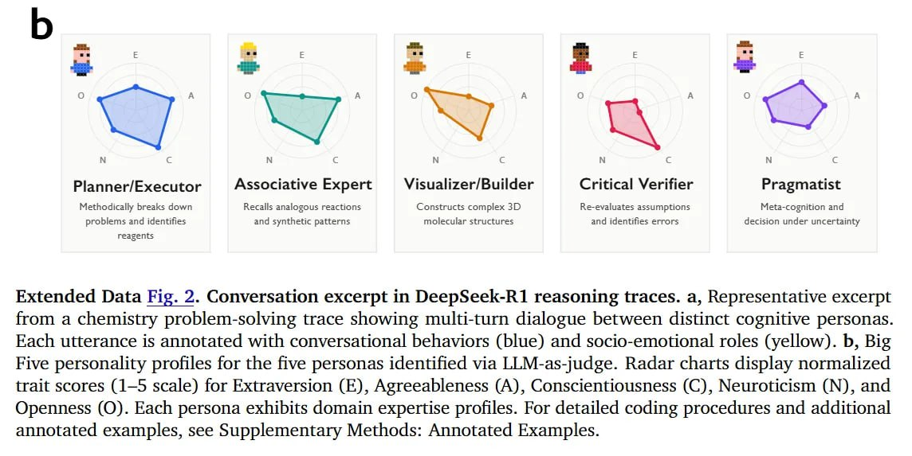

# Image Description

**File:** img_1769229550_aqadsbfrg3g6eet_image_extended_data_fig.jpg
**Original:** image.jpg
**Received:** 1769229550

## Extracted Text (OCR)

<!-- image -->

Extended Data Fig. 2. Conversation excerpt in DeepSeek-R1 reasoning traces. a, Representative excerpt from a chemistry problem-solving trace showing multi-turn dialogue between distinct cognitive personas. Each utterance is annotated with conversational behaviors (blue) and socio-emotional roles (yellow). b, Big Five personality profiles for the five personas identified via LLM-as-judge. Radar charts display normalized trait scores (1-5 scale) for Extraversion (Е), Agreeableness (A), Conscientiousness (С), Neuroticism (М), and Openness (QO). Each persona exhibits domain expertise profiles. For detailed coding procedures and additional annotated examples, see Supplementary Methods: Annotated Examples.

## Usage Instructions

When referencing this image in markdown:
1. Use relative path based on file location
2. Add descriptive alt text based on OCR content above
3. Add text description BELOW the image for GitHub rendering

Example:
```markdown
 <!-- TODO: Broken image path -->

**Image shows:** [Describe what the image contains based on OCR]
```
