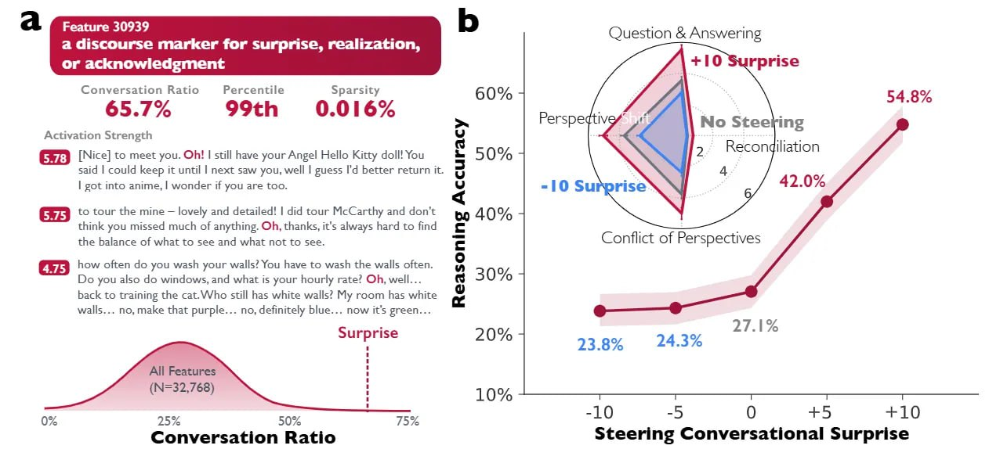

# Image Description

**File:** img_1769229550_aqadsrfrg3g6eet_discourse_marker_for.jpg
**Original:** image.jpg
**Received:** 1769229550

## Extracted Text (OCR)

—. ие

а discourse marker for su

Question &amp; Answering

rise, realization, ae ee

Surprise 20% - 238% 24.3%

Conversation Ratio steering Conversational Surprise

<!-- image -->

<!-- image -->

## Usage Instructions

When referencing this image in markdown:
1. Use relative path based on file location
2. Add descriptive alt text based on OCR content above
3. Add text description BELOW the image for GitHub rendering

Example:
```markdown
 <!-- TODO: Broken image path -->

**Image shows:** [Describe what the image contains based on OCR]
```
