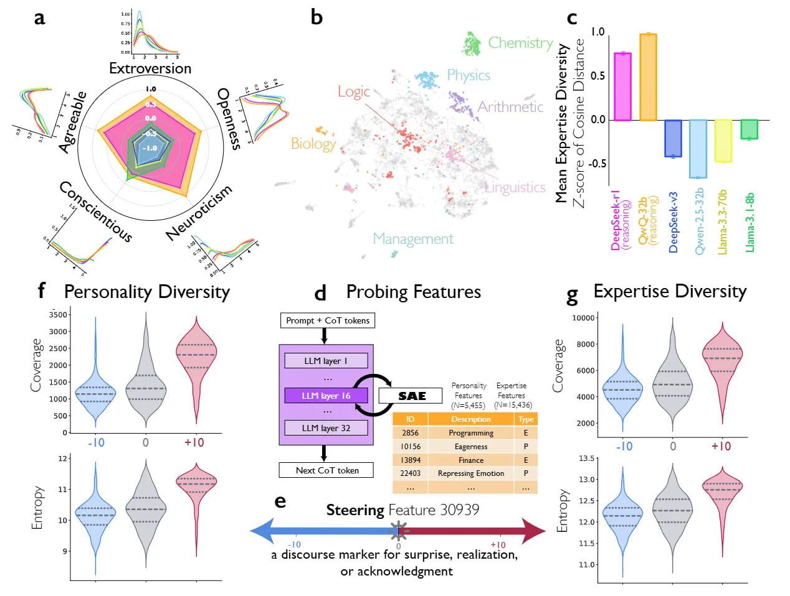

# Image Description

**File:** img_1769229550_aqadtxfrg3g6eet_11_vay.jpg
**Original:** image.jpg
**Received:** 1769229550

## Extracted Text (OCR)

11

о рее Vay | = Steering Feature 50737

rer

Cc 120

—H uy oe
a discourse marker for surprise, realization,

Ем

12.0.

11.5.

or acknowledgment

AUSABAIC] Э5134эах3 чез|

SIUPRISIC] SUISO™) LO э4955-/

|.I-yaogda0q

(10523.

qe ме

ао

ЧО! -5`С-ЕЩМЕГ

cA-yoaCda0C

т ¢-C'7 liar)

g Expertise Diversity onnn J

a ll
BD 25004

BE

B000

6000-

р Personality. Expertise

OQ
te

Gee | ананнниь я a | | ИИ: - АИ | Е |  ГЕЕНУез Гаабгез 4000 -

(W=5.455)  [14=15,426)

НИ |

——

121

;3p04

ECinancro

Next CoT token

## Usage Instructions

When referencing this image in markdown:
1. Use relative path based on file location
2. Add descriptive alt text based on OCR content above
3. Add text description BELOW the image for GitHub rendering

Example:
```markdown
 <!-- TODO: Broken image path -->

**Image shows:** [Describe what the image contains based on OCR]
```
