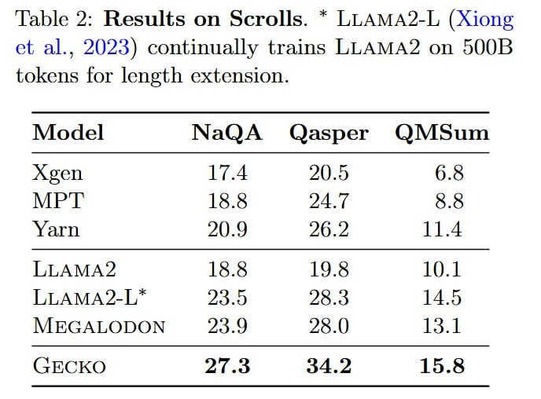

# Image Description

**File:** img_1769229577_aqadahbrgyoniet9_table_2_results_on_scrolls.jpg
**Original:** image.jpg
**Received:** 1769229577

## Extracted Text (OCR)

Table 2: Results on Scrolls. * LLAMA2-L (Xiong et al., 2023) continually trains LLAMA2 on 500B tokens for length extension.

|                             | Моае NaQA Qasper QMsum   |
|-----------------------------|--------------------------|
|                             | Agen  17.4  20.5  6.8    |
| MPL  18.8  р  хх            |                          |
| Yarn  20.9  26.2  11.4      |                          |
| LLAMA? 18.8 19.8 10.1       |                          |
| LLAMA?-L”*  73 5  OS 3  14. |                          |
| MEGALODON 23.9 25 () 13.1   |                          |
| ТЕСКО oT 3 34.2 15.8        |                          |

## Usage Instructions

When referencing this image in markdown:
1. Use relative path based on file location
2. Add descriptive alt text based on OCR content above
3. Add text description BELOW the image for GitHub rendering

Example:
```markdown
 <!-- TODO: Broken image path -->

**Image shows:** [Describe what the image contains based on OCR]
```
