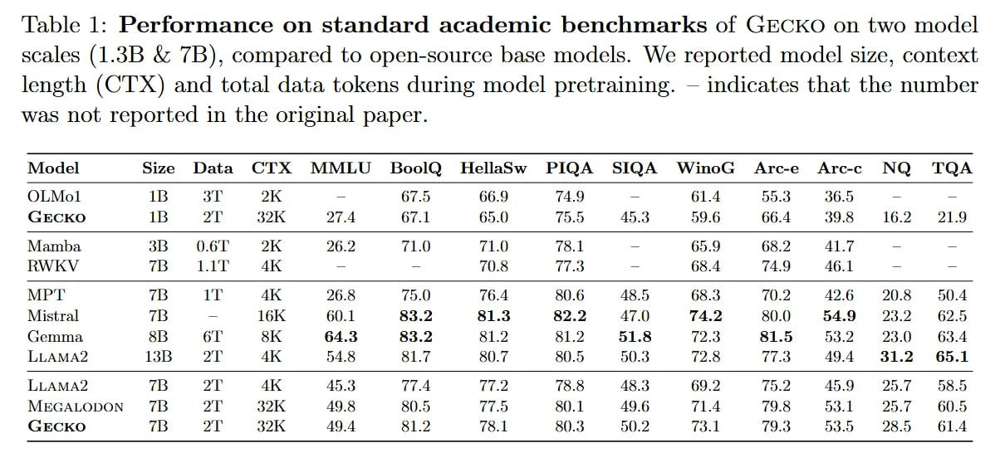

# Image Description

**File:** img_1769229577_aqadaxbrgyoniet_table_performance_on_standard_academic.jpg
**Original:** image.jpg
**Received:** 1769229577

## Extracted Text (OCR)

'Table |: Performance on standard academic benchmarks of GECKO on two model scales (1.3В &amp; 7B), compared to open-source base models. We reported model size, context length (CTX) and total data tokens during model pretraining. — indicates that the number was not reported in the original paper.

|                                                                     | Model Size Data CTX MMLU Воою HellaSw РШФА SIOA WinoG Arc-e Are-c МО TOA   |
|---------------------------------------------------------------------|----------------------------------------------------------------------------|
| ИМО 1$ ak aK. — 67.5 66.9 74.9 — 61.4  oT сл я  "он ‘tt  36.5       |                                                                            |
| (SECKO 11$ р AK, of A 67.1 65.0 75.5 A538 96 66.4 395 1602 29       |                                                                            |
| Vlamba 33 £O.61 OK 26.2 710 71.0 "5. ] — 65.9 682 417               |                                                                            |
| 73  ТГ  АК  TOUS  т $  68.4  TAQ  40.1                              |                                                                            |
| MPT  73 ТГ АК 268 75.0 76.4 ROG ARS 68.3 70.2 496 я  £#50.4         |                                                                            |
| Мета 713 — THK 60.1 R39 813 822 47 0 TA SO.0 549 339 #4635          |                                                                            |
| (emma. Я В як 64.3 3$ 12 RY] 51S rey Ч 15 ра 9 73 ) 6.4             |                                                                            |
| LLAMA? 13$ Alb AK 548 S17 5.7 B05 50.3 728 77.8 494 31.2 6511       |                                                                            |
| LLAMA? 73 РА АК 410.53 77.4 77.2 75 5 ARS 69 75.2 AB                |                                                                            |
| MECALODON £&7TI р Е, AQGR SOS м eB Si) 1 AQ A TLA 70 Я 2] 95 7  61С |                                                                            |
| ЕСС»  р  м.  AQ A  gS] 3  та ]  ROS  Al)?  7% ]                     |                                                                            |

## Usage Instructions

When referencing this image in markdown:
1. Use relative path based on file location
2. Add descriptive alt text based on OCR content above
3. Add text description BELOW the image for GitHub rendering

Example:
```markdown
 <!-- TODO: Broken image path -->

**Image shows:** [Describe what the image contains based on OCR]
```
