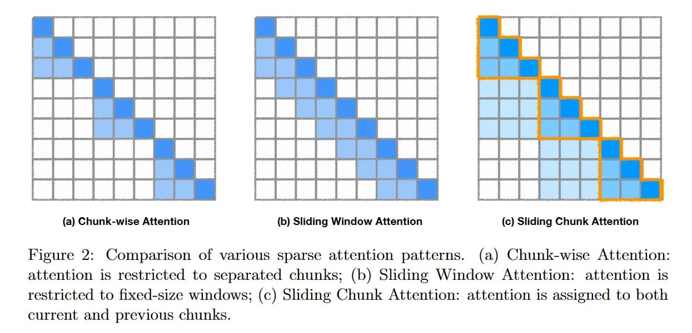

# Image Description

**File:** img_1769229577_aqadyxbrgyoniet_figure_2_comparison_of_various_sparse.jpg
**Original:** image.jpg
**Received:** 1769229577

## Extracted Text (OCR)

Figure 2: Comparison of various sparse attention patterns. (a) Chunk-wise Attention: attention is restricted to separated chunks; (b) Sliding Window Attention: attention is restricted to fixed-size windows; (c) Sliding Chunk Attention: attention is assigned to both current and previous chunks.

<!-- image -->

## Usage Instructions

When referencing this image in markdown:
1. Use relative path based on file location
2. Add descriptive alt text based on OCR content above
3. Add text description BELOW the image for GitHub rendering

Example:
```markdown
 <!-- TODO: Broken image path -->

**Image shows:** [Describe what the image contains based on OCR]
```
