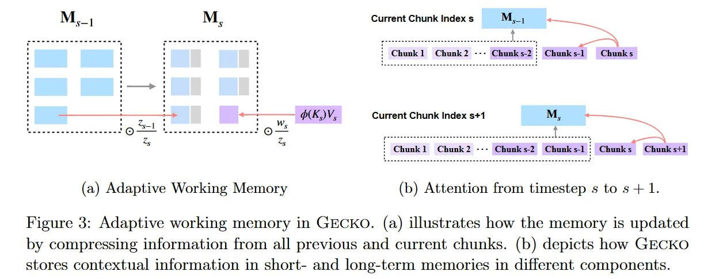

# Image Description

**File:** img_1769229577_aqadzrbrgyoniet_figure_3_adaptive_working_memory_in.jpg
**Original:** image.jpg
**Received:** 1769229577

## Extracted Text (OCR)

Figure 3: Adaptive working memory in GECKO. (a) illustrates how the memory is updated by compressing information from all previous and current chunks. (b) depicts how GECKO stores contextual information in short- and long-term memories in different components.

<!-- image -->

## Usage Instructions

When referencing this image in markdown:
1. Use relative path based on file location
2. Add descriptive alt text based on OCR content above
3. Add text description BELOW the image for GitHub rendering

Example:
```markdown
 <!-- TODO: Broken image path -->

**Image shows:** [Describe what the image contains based on OCR]
```
