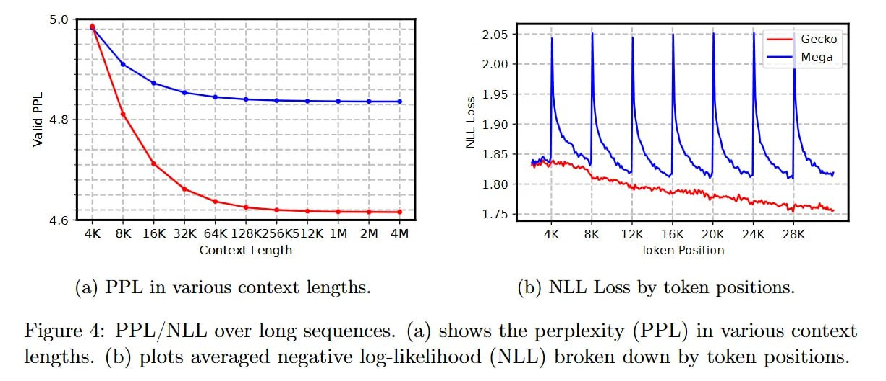

# Image Description

**File:** img_1769229577_aqadzxbrgyoniet_figure_4_ppl_nll_over_long_sequences.jpg
**Original:** image.jpg
**Received:** 1769229577

## Extracted Text (OCR)

Figure 4: PPL/NLL over long sequences. (a) shows the perplexity (PPL) in various context lengths. (b) plots averaged negative log-likelihood (NLL) broken down by token positions.

<!-- image -->

## Usage Instructions

When referencing this image in markdown:
1. Use relative path based on file location
2. Add descriptive alt text based on OCR content above
3. Add text description BELOW the image for GitHub rendering

Example:
```markdown
 <!-- TODO: Broken image path -->

**Image shows:** [Describe what the image contains based on OCR]
```
