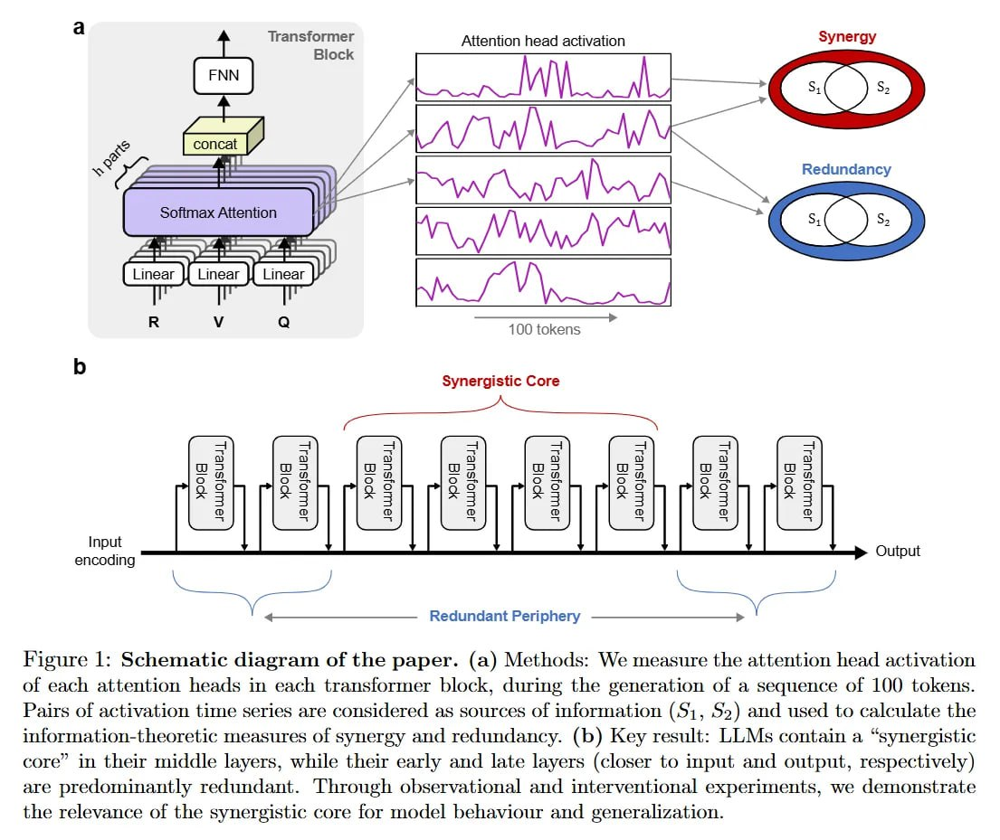

# Image Description

**File:** img_1769229613_aqad8bfrgxkgkut_figure_1_schematic_diagram_of_the.jpg
**Original:** image.jpg
**Received:** 1769229613

## Extracted Text (OCR)

Figure 1: Schematic diagram of the paper. (a) Methods: We measure the attention head activation of each attention heads in each transtormer block, during the generation of a sequence of 100 tokens. Pairs of activation time series are considered as sources of information (51, 52) and used to calculate the information-theoretic measures of synergy and redundancy. (b) Key result: LLMs contain a "synergistic core" in their middle layers, while their early and late layers (closer to input and output, respectively) are predonunantly redundant. Lhrough observational and interventional experiments, we demonstrate the relevance of the synergistic core tor model behaviour and generalization.

<!-- image -->

## Usage Instructions

When referencing this image in markdown:
1. Use relative path based on file location
2. Add descriptive alt text based on OCR content above
3. Add text description BELOW the image for GitHub rendering

Example:
```markdown
 <!-- TODO: Broken image path -->

**Image shows:** [Describe what the image contains based on OCR]
```
