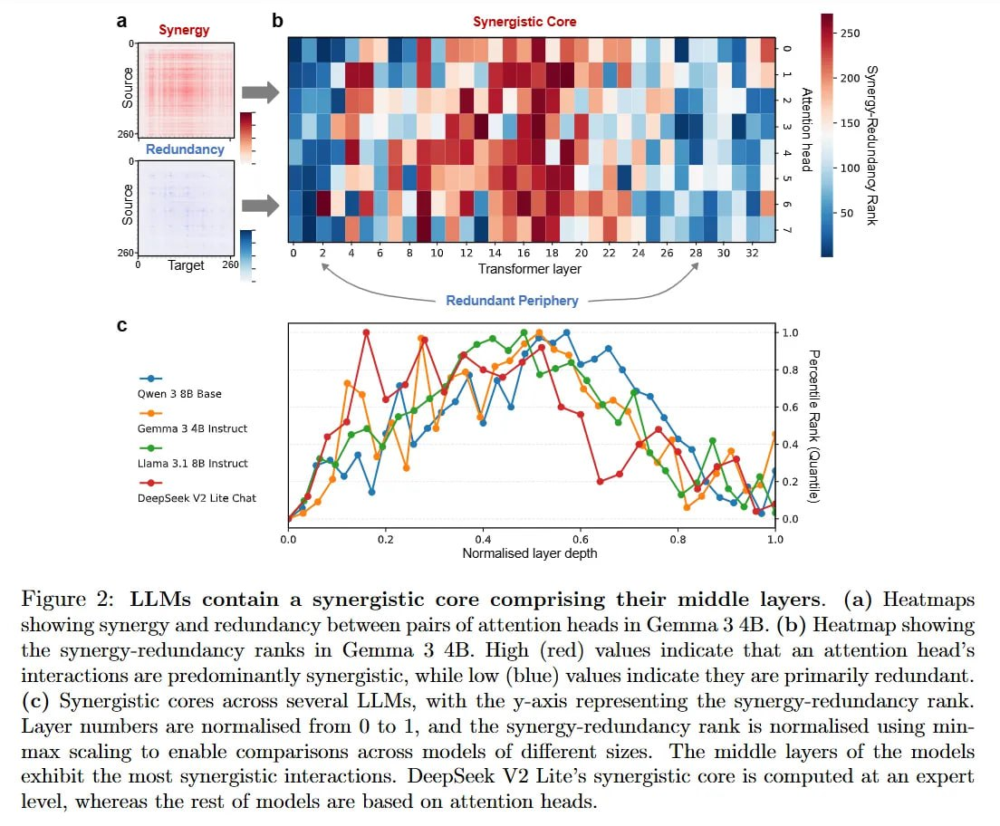

# Image Description

**File:** img_1769229613_aqad8rfrgxkgkut_figure_2_llms_contain_a_synergistic.jpg
**Original:** image.jpg
**Received:** 1769229613

## Extracted Text (OCR)

Figure 2: LLMs contain a synergistic core comprising their middle layers. (a) Heatmaps showing synergy and redundancy between pairs of attention heads in Gemma 3 4B. (b) Heatmap showing the synergy-redundancy ranks in Gemma 3 4B. High (red) values indicate that an attention head's interactions are predominantly synergistic, while low (blue) values indicate they are primarily redundant. (c) Synergistic cores across several LLMs, with the y-axis representing the synergy-redundancy rank. Layer mumbers are normalsed from 0 to 1, and the synergy-redundancy rank 1s normalised using minmax scaling to enable comparisons across models of different sizes. The middle layers of the models exhibit the most synergistic interactions. Deepseek V2 Lite's synergistic core 1s computed at an expert level, whereas the rest of models are based on attention heads.

<!-- image -->

## Usage Instructions

When referencing this image in markdown:
1. Use relative path based on file location
2. Add descriptive alt text based on OCR content above
3. Add text description BELOW the image for GitHub rendering

Example:
```markdown
 <!-- TODO: Broken image path -->

**Image shows:** [Describe what the image contains based on OCR]
```
