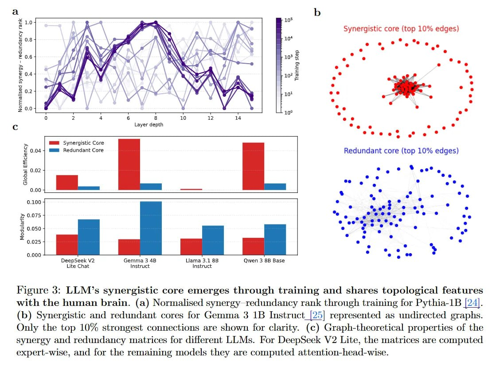

# Image Description

**File:** img_1769229613_aqad8xfrgxkgkut_figure_3_llm_s_synergistic_core_emerges.jpg
**Original:** image.jpg
**Received:** 1769229613

## Extracted Text (OCR)

Figure 3: LLM's synergistic core emerges through training and shares topological features with the human brain. (a) Normalised synergy redundancy rank through traiming for Pythia-1B |124]. (b) Synergistic and redundant cores for Gemma 3 1B Instruct\_[25) represented as undirected graphs. Only the top 10% strongest connections are shown for clarity. (с) Graph-theoretical properties of the synergy and redundancy matrices tor difterent LLMs. Вог Deepseek V2 Lite, the matrices are computed expert-wise, and for the remaiming models they are computed attention-head-wise.

<!-- image -->

## Usage Instructions

When referencing this image in markdown:
1. Use relative path based on file location
2. Add descriptive alt text based on OCR content above
3. Add text description BELOW the image for GitHub rendering

Example:
```markdown
 <!-- TODO: Broken image path -->

**Image shows:** [Describe what the image contains based on OCR]
```
