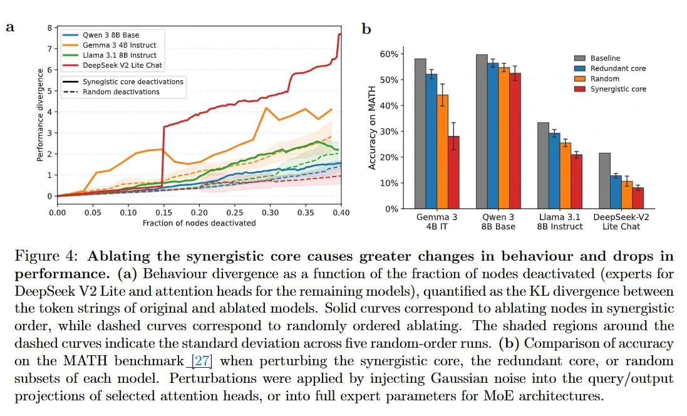

# Image Description

**File:** img_1769229613_aqad9bfrgxkgkut_figure_4_ablating_the_synergistic_core.jpg
**Original:** image.jpg
**Received:** 1769229613

## Extracted Text (OCR)

Figure 4: Ablating the synergistic core causes greater changes in behaviour and drops in performance. (a) Behaviour divergence as a function of the fraction of nodes deactivated (experts for DeepSeek V2 Lite and attention heads for the remaining models), quantified as the KL divergence between the token strings of original and ablated models. Solid curves correspond to ablating nodes im synergistic order, while dashed curves correspond to randomly ordered ablating. [Lhe shaded regions around the dashed curves indicate the standard deviation across five random-order runs. (b) Comparison of accuracy on the MATH benchmark |27| when perturbing the synergistic core, the redundant core, or random subsets of each model. Perturbations were apphed by injecting Gaussian noise into the query/output projections of selected attention heads, or into fill expert parameters tor Mor architectures.

<!-- image -->

## Usage Instructions

When referencing this image in markdown:
1. Use relative path based on file location
2. Add descriptive alt text based on OCR content above
3. Add text description BELOW the image for GitHub rendering

Example:
```markdown
 <!-- TODO: Broken image path -->

**Image shows:** [Describe what the image contains based on OCR]
```
