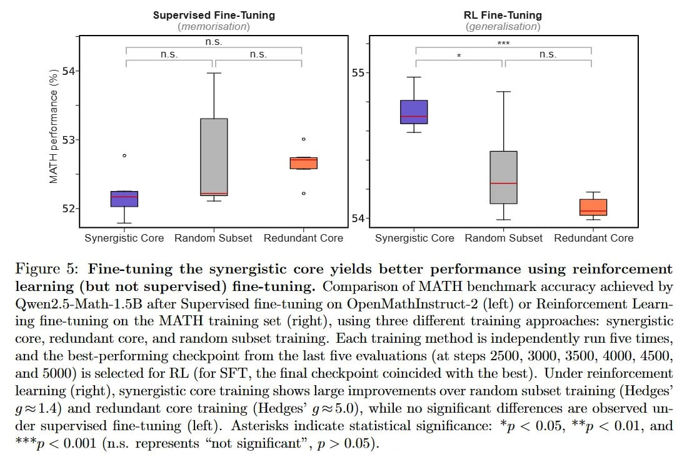

# Image Description

**File:** img_1769229613_aqad9rfrgxkgkut_figure_5_fine_tuning_the_synergistic_cor.jpg
**Original:** image.jpg
**Received:** 1769229613

## Extracted Text (OCR)

Figure 5: Fine-tuning the synergistic core yields better performance using reinforcement learning (but not supervised) fine-tuning. Comparison of MATH benchmark accuracy achieved by ()wen2.5-Math-1.5B after Supervised fine-tuning on OpenMathInstruct-2 (left) or Reinforcement Learning fine-tuning on the MATH training set (right), using three different training approaches: synergistic core, redundant core, and random subset traimmeg. Kach trainmg method is independently run five times, and the best-performing checkpoint from the last five evaluations (at steps 2500, 3000, 3500, 4000, 4500, and 5000) is selected for RL (for ЭЕТ, the final checkpoint coincided with the best). Under reinforcement learning (right), synergistic core training shows large improvements over random subset training (Hedges' g 1.4) and redundant core training (Hedges' g~5.0), while no significant differences are observed under supervised fine-tuning (left). Asterisks indicate statistical significance: *p &lt; 0.05, **p &lt; 0.01, and "Тр &lt; 0.001 (n.s. represents "not significant", р &gt; 0.05).

<!-- image -->

## Usage Instructions

When referencing this image in markdown:
1. Use relative path based on file location
2. Add descriptive alt text based on OCR content above
3. Add text description BELOW the image for GitHub rendering

Example:
```markdown
 <!-- TODO: Broken image path -->

**Image shows:** [Describe what the image contains based on OCR]
```
