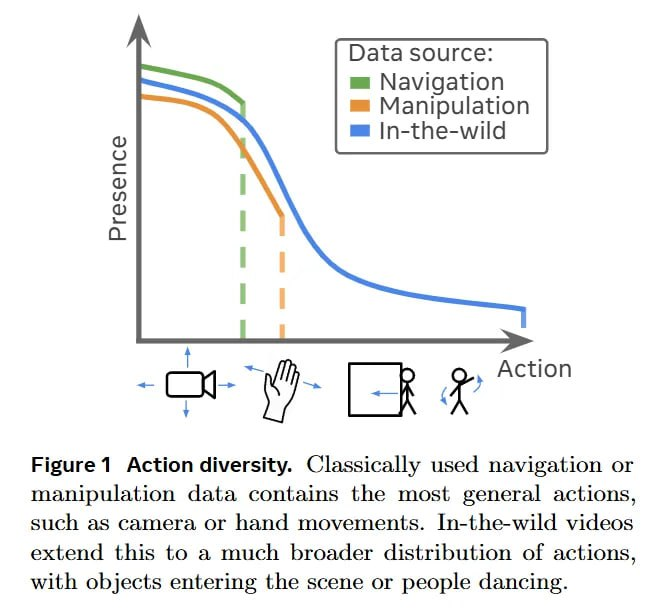

# Image Description

**File:** img_1769229661_aqadsg5rgxkgmut9_figure_1_action_diversity_classically_us.jpg
**Original:** image.jpg
**Received:** 1769229661

## Extracted Text (OCR)

Figure 1 Action diversity. Classically used navigation or manipulation data contains the most general actions, 311-й as camera or hand movements. [n-the-wild videos extend this to a much broader distribution of actions, with objects entering the scene or people dancing.

<!-- image -->

## Usage Instructions

When referencing this image in markdown:
1. Use relative path based on file location
2. Add descriptive alt text based on OCR content above
3. Add text description BELOW the image for GitHub rendering

Example:
```markdown
 <!-- TODO: Broken image path -->

**Image shows:** [Describe what the image contains based on OCR]
```
