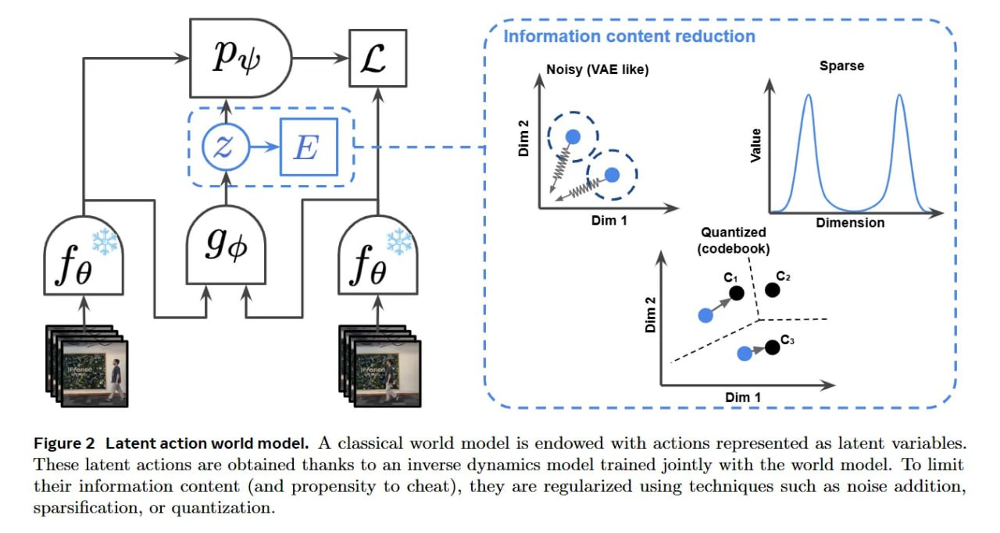

# Image Description

**File:** img_1769229661_aqadtg5rgxkgmut_figure_2_latent_action_world_model.jpg
**Original:** image.jpg
**Received:** 1769229661

## Extracted Text (OCR)

Figure 2 Latent action world model. A classical world model is endowed with actions represented as latent variables. These latent actions are obtained thanks to an inverse dynamics model trained jointly with the world model. To limit their information content (and propensity to cheat), they are regularized using techniques such as noise addition, sparsification, or quantization.

<!-- image -->

## Usage Instructions

When referencing this image in markdown:
1. Use relative path based on file location
2. Add descriptive alt text based on OCR content above
3. Add text description BELOW the image for GitHub rendering

Example:
```markdown
 <!-- TODO: Broken image path -->

**Image shows:** [Describe what the image contains based on OCR]
```
