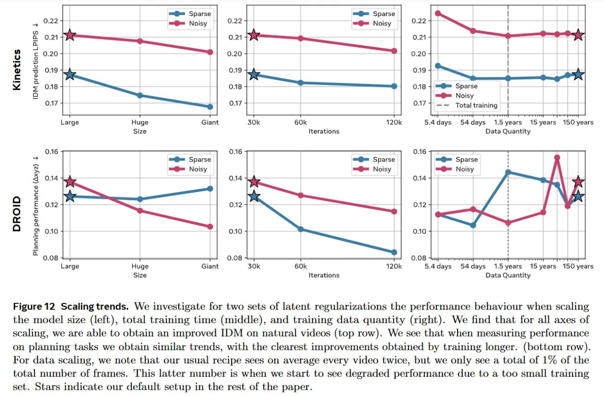

# Image Description

**File:** img_1769229661_aqadtw5rgxkgmut_figure_12_scaling_trends_we_investigate.jpg
**Original:** image.jpg
**Received:** 1769229661

## Extracted Text (OCR)

Figure 12 Scaling trends. We investigate for two sets of latent regularizations the performance behaviour when scaling the model size (left), total training time (middle), and training data quantity (right). We find that for all axes of scaling, we are able to obtain an improved IDM on natural videos (top row). We see that when measuring performance on planning tasks we obtain similar trends, with the clearest improvements obtained by training longer. (bottom row). For data scaling, we note that our usual recipe sees on average every video twice, but we only see a total of 1% of the total number of frames. This latter number is when we start to see degraded performance due to a too small training set. Stars indicate our delault setup in the rest of the paper.

<!-- image -->

## Usage Instructions

When referencing this image in markdown:
1. Use relative path based on file location
2. Add descriptive alt text based on OCR content above
3. Add text description BELOW the image for GitHub rendering

Example:
```markdown
 <!-- TODO: Broken image path -->

**Image shows:** [Describe what the image contains based on OCR]
```
