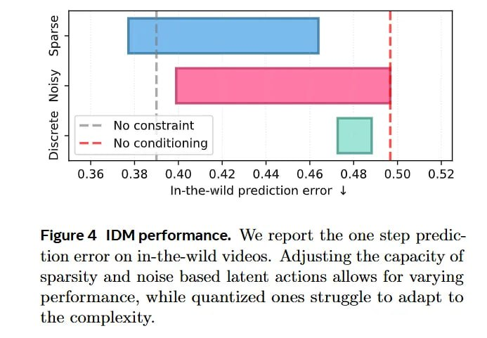

# Image Description

**File:** img_1769229661_aqadua5rgxkgmut9_image_figure_4.jpg
**Original:** image.jpg
**Received:** 1769229661

## Extracted Text (OCR)

<!-- image -->

Figure 4 ОМ реогтапсе. We report the one step prediction error on in-the-wild videos. Adjusting the capacity of sparsity and noise based latent actions allows for varying performance, while quantized ones struggle to adapt to the complexity.

## Usage Instructions

When referencing this image in markdown:
1. Use relative path based on file location
2. Add descriptive alt text based on OCR content above
3. Add text description BELOW the image for GitHub rendering

Example:
```markdown
 <!-- TODO: Broken image path -->

**Image shows:** [Describe what the image contains based on OCR]
```
