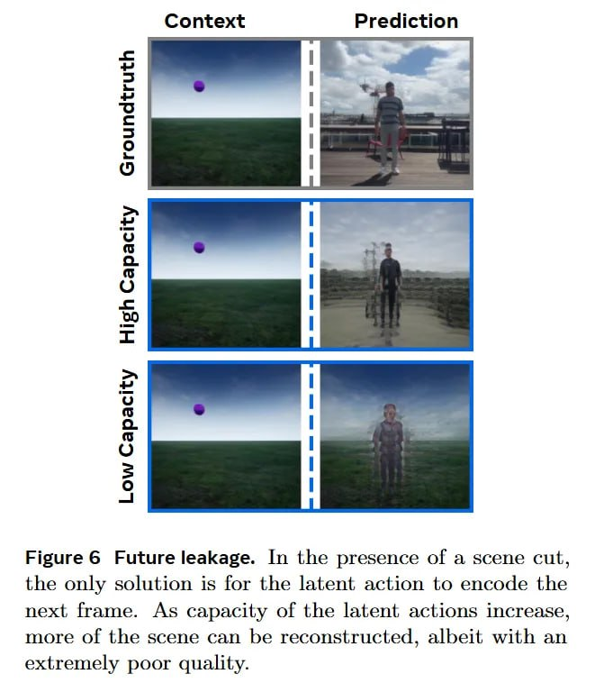

# Image Description

**File:** img_1769229661_aqaduq5rgxkgmut9_figure_6_future_leakage_in_the.jpg
**Original:** image.jpg
**Received:** 1769229661

## Extracted Text (OCR)

Figure 6 Future leakage. In the presence of a scene cut, the only solution is for the latent action to encode the next frame. As capacity of the latent actions increase, more of the scene can be reconstructed, albeit with an extremely poor quality.

<!-- image -->

## Usage Instructions

When referencing this image in markdown:
1. Use relative path based on file location
2. Add descriptive alt text based on OCR content above
3. Add text description BELOW the image for GitHub rendering

Example:
```markdown
 <!-- TODO: Broken image path -->

**Image shows:** [Describe what the image contains based on OCR]
```
