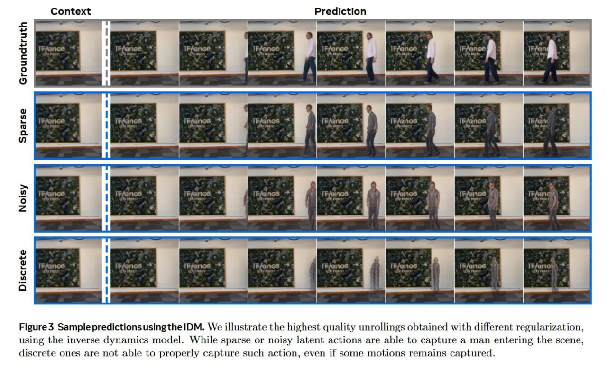

# Image Description

**File:** img_1769229661_aqaduw5rgxkgmut_uoidipdald_2_cag_sulg_let_sli.jpg
**Original:** image.jpg
**Received:** 1769229661

## Extracted Text (OCR)

UOIDIPDAld
зхазцо2

CAG. SULG Let SLI GUIs Jt Uo LU Ца OAL SLI 4} th зо Gu SOL ор 'NAMI? СПИ STIOTIOT DUIOS Tl ПЗАЗ 'ПОРТ Wns ПИР АТТУО OF схае лоп DIP SOTIO D101IDSIN '9099S 90) SUIS TWeUT ® эп13а35 01 BIGe эге SUOTJOV 19918] ASTOU JO asTeds эПпЧлА Тэропт SOTUTRUAP эбтэлпт OT} SUTSTI 'TMOTVZLIL[NSal JUaIayIp YIM poeuleygo SsulpyjoIuN АзЦепьо Jsolpsty sty} oyeIYSN]TI Эла 'ЭЦ Sulsnsuonsipsidajdwes $ ainsi

<!-- image -->

## Usage Instructions

When referencing this image in markdown:
1. Use relative path based on file location
2. Add descriptive alt text based on OCR content above
3. Add text description BELOW the image for GitHub rendering

Example:
```markdown
 <!-- TODO: Broken image path -->

**Image shows:** [Describe what the image contains based on OCR]
```
