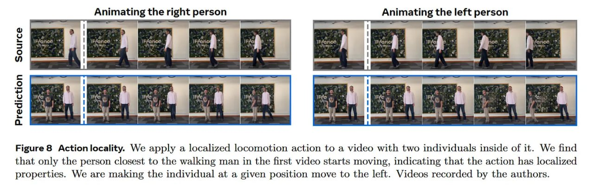

# Image Description

**File:** img_1769229661_aqadva5rgxkgmut_uomllipsig_animating_the.jpg
**Original:** image.jpg
**Received:** 1769229661

## Extracted Text (OCR)

## эп UOMllipsig

## Animating the right person Animating the left person

<!-- image -->

<!-- image -->

<!-- image -->

<!-- image -->

Figure 8 Action locality. We apply a localized locomotion action to a video with two individuals inside of it. We find that only the person closest to the walking man in the first video starts moving, indicating that the action has localized properties. We are making the individual at a given position move to the left. Videos recorded by the authors.

## Usage Instructions

When referencing this image in markdown:
1. Use relative path based on file location
2. Add descriptive alt text based on OCR content above
3. Add text description BELOW the image for GitHub rendering

Example:
```markdown
 <!-- TODO: Broken image path -->

**Image shows:** [Describe what the image contains based on OCR]
```
