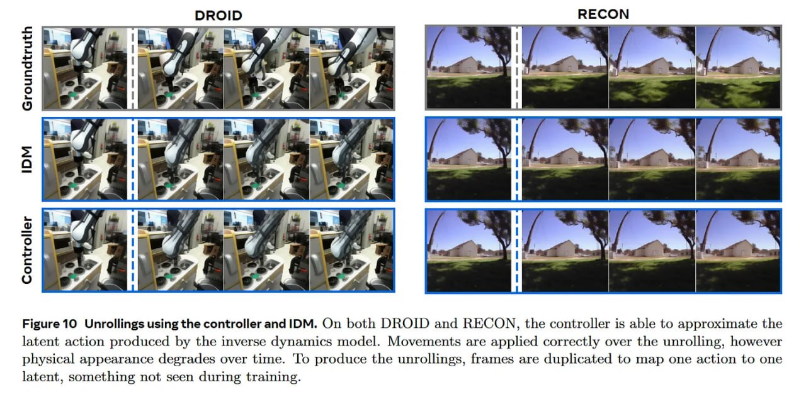

# Image Description

**File:** img_1769229661_aqadvg5rgxkgmut_figure_10_unrollings_using_the_controlle.jpg
**Original:** image.jpg
**Received:** 1769229661

## Extracted Text (OCR)

Figure 10 Unrollings using the controller and IDM. On both DROID and RECON, the controller 1$ able to approximate the latent action produced by the inverse dynamics model. Movements are apphed correctly over the unrolling, however physical appearance degrades over time. То produce the unrollings, frames are duplicated to map one action to one latent, something not seen during training.

<!-- image -->

## Usage Instructions

When referencing this image in markdown:
1. Use relative path based on file location
2. Add descriptive alt text based on OCR content above
3. Add text description BELOW the image for GitHub rendering

Example:
```markdown
 <!-- TODO: Broken image path -->

**Image shows:** [Describe what the image contains based on OCR]
```
