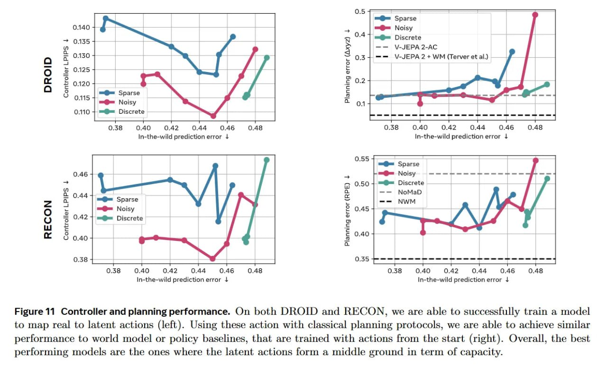

# Image Description

**File:** img_1769229661_aqadwa5rgxkgmut_figure_11_controller_and_planning_perfor.jpg
**Original:** image.jpg
**Received:** 1769229661

## Extracted Text (OCR)

Figure 11 Controller and planning performance. On both DROID and RECON, we are able to successfully train a model to map real to latent actions (left). Using these action with classical planning protocols, we are able to achieve similar performance to world model or policy baselines, that are trained with actions from the start (right). Overall, the best performing models are the ones where the latent actions form a middle ground in term of capacity.

<!-- image -->

## Usage Instructions

When referencing this image in markdown:
1. Use relative path based on file location
2. Add descriptive alt text based on OCR content above
3. Add text description BELOW the image for GitHub rendering

Example:
```markdown
 <!-- TODO: Broken image path -->

**Image shows:** [Describe what the image contains based on OCR]
```
