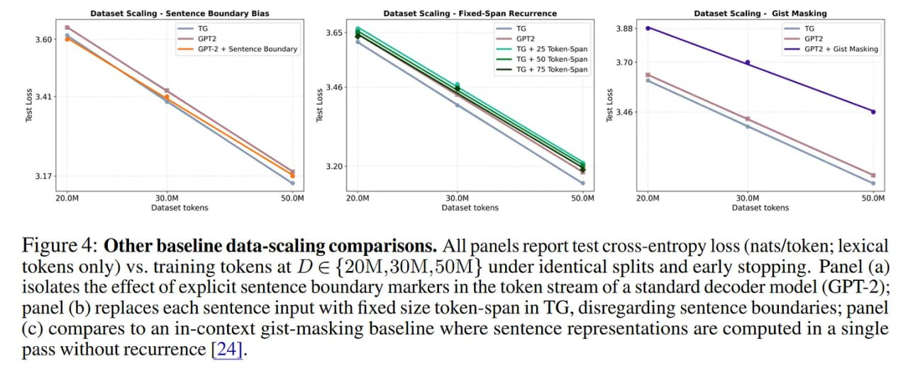

# Image Description

**File:** img_1769264937_aqadawtrghzqet_figure_4_other_baseline_data_scaling_com.jpg
**Original:** image.jpg
**Received:** 1769264937

## Extracted Text (OCR)

Figure 4: Other baseline data-scaling comparisons. All panels report test cross-entropy loss (nats/token; lexical tokens only) vs. training tokens at D € {20M,30M,50M} under identical splits and early stopping. Panel (a) isolates the effect of explicit sentence boundary markers in the token stream of a standard decoder model (GP 1-2); panel (b) replaces each sentence input with fixed size token-span in TG, disregarding sentence boundaries; panel (с) compares to an 1n-context gist-masking baseline where sentence representations are computed in a single pass without recurrence [24].

<!-- image -->

## Usage Instructions

When referencing this image in markdown:
1. Use relative path based on file location
2. Add descriptive alt text based on OCR content above
3. Add text description BELOW the image for GitHub rendering

Example:
```markdown
 <!-- TODO: Broken image path -->

**Image shows:** [Describe what the image contains based on OCR]
```
