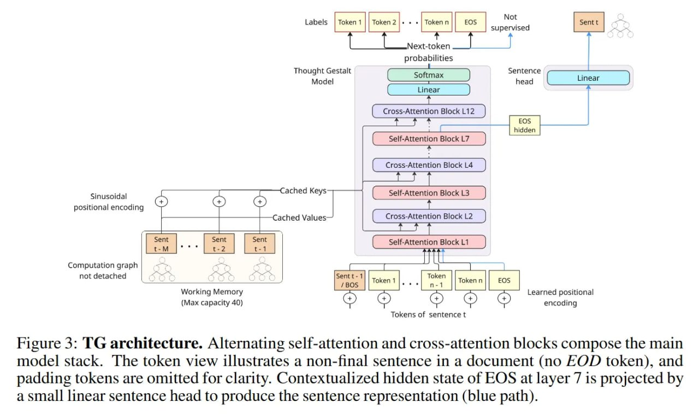

# Image Description

**File:** img_1769264937_aqadzwtrghzqet_figure_3_tg_architecture_alternating_sel.jpg
**Original:** image.jpg
**Received:** 1769264937

## Extracted Text (OCR)

Figure 3: TG architecture. Alternating self-attention and cross-attention blocks compose the main model stack. The token view illustrates a non-final sentence ш a document (no EOD token), and padding tokens are omitted for clarity. Contextualized hidden state of EOS at layer 7 1s projected by a small linear sentence head to produce the sentence representation (blue path).

<!-- image -->

## Usage Instructions

When referencing this image in markdown:
1. Use relative path based on file location
2. Add descriptive alt text based on OCR content above
3. Add text description BELOW the image for GitHub rendering

Example:
```markdown
 <!-- TODO: Broken image path -->

**Image shows:** [Describe what the image contains based on OCR]
```
