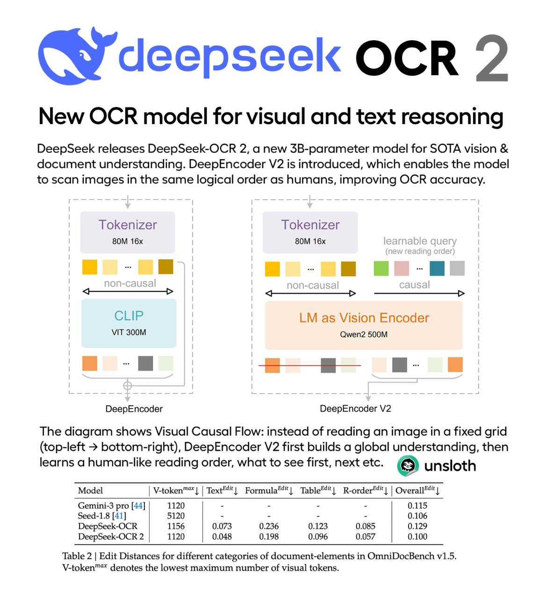

# Image Description

**File:** img_1769508276_aqaduhfrg1t5wet_image_new_ocr.jpg
**Original:** image.jpg
**Received:** 1769508276

## Extracted Text (OCR)

<!-- image -->

## New OCR model for visual and text reasoning

DeepSeek releases DeepSeek-OCR 2, a new 3B-parameter model for SOTA vision &amp; document understanding. DeepEncoder \2 Is introduced, which enables the model to scan images In the same logical order as humans, improving OCR accuracy.

Tokenizer | | Tokenizer

SOM 16x BOM 16x eoanane ay

YH

IN-Causal | 1 ! non-causal causal

CLIP

| Mas Vision Encoder

VIT 300M Qwen? 500M

DeepEncoder DeepEncoder V2

<!-- image -->

<!-- image -->

The diagram shows Visual Causal Flow: instead of reading an image in a fixed grid (top-left &gt; bottom-right), DeepEncoder V2 first builds a global understanding, then learns a human-like reading order, what to see first, next etc. © unsloth

<!-- image -->

|                                                         | Model | V-token™™ | | Тех" | Formula**"| Table**"| R-order**"| | Overall®*"|   |
|---------------------------------------------------------|--------------------------------------------------------------------------------|
| Gemini-3 рго [44] | 1120 | - - - - | 0.115              |                                                                                |
| Seed-1.8 [41] | 5120 | - - - - | 0.106                  |                                                                                |
| DeepSeek-OCR | 1156 | 0.073 0.236 0.123 0.085 | 0.129   |                                                                                |
| DeepSeek-OCR2 | 1120 | 0.048 0.198 0.096 0.0575 | 0.100 |                                                                                |

Table 2 | Edit Distances for different categories of document-elements in OmniDocBench v1.5. V-token™" denotes the lowest maximum number of visual tokens.

## Usage Instructions

When referencing this image in markdown:
1. Use relative path based on file location
2. Add descriptive alt text based on OCR content above
3. Add text description BELOW the image for GitHub rendering

Example:
```markdown
 <!-- TODO: Broken image path -->

**Image shows:** [Describe what the image contains based on OCR]
```
