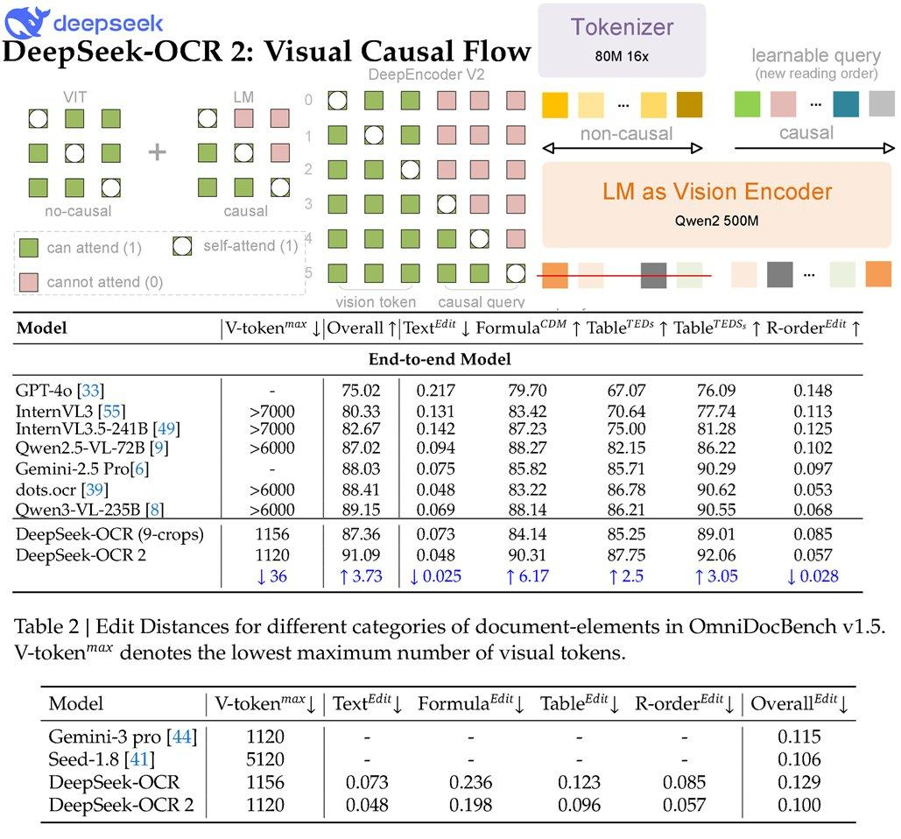

# Image Description

**File:** img_1769508276_aqaduxfrg1t5wet.jpg
**Original:** image.jpg
**Received:** 1769508276

## Extracted Text (OCR)

|                                                                                                                                   |                       |                                        |                                                                                          | | V-token™® || Overall T/Text®*" | Formula®?™ 7 Table’*?s 1 Table’#?°: T R-order**“ 1   |                  |                  |                  |
|-----------------------------------------------------------------------------------------------------------------------------------|-----------------------|----------------------------------------|------------------------------------------------------------------------------------------|-----------------------------------------------------------------------------------------|------------------|------------------|------------------|
| End-to-end Model                                                                                                                  | End-to-end Model      | End-to-end Model                       | End-to-end Model                                                                         | End-to-end Model                                                                        | End-to-end Model | End-to-end Model | End-to-end Model |
| GP T-40 [33 InternVL3 [55] InternVL3.5-241B [49] Owen2.5-VL-72B [9] Gemini-2.5 Pro|6| dots.ocr [59] DeepSeek-OCK (9-crops) | 1156 | DeepSeek-OCR 2 | 1120 | 2“ 0.131] 9109 | 10.0248 Tero | 10.025 | 6/07  76.09 764.  У УД ate atl od a 14 io he 89 0] 90.3]  ВУ 5  97 06 T 6.17 Т2.5 Т 3.05 | () ]48 | 0.028                                                                          |                  |                  |                  |

<!-- image -->

Table 2 | Ван Distances for different categories of document-elements in OmniDocBench v1.9. V-token™®" denotes the lowest maximum number of visual tokens.

|                          | V-token”™ | | Тех" | Formula’) Table®*"| R-order®*"| | Overall’*"|   |
|--------------------------|----------------------------------------------------------------------|
| Gemini-3 pro [44| | 1120 |                                                                      |
| Seed-1.8 [41] | 5120     |                                                                      |
| DeepSeek-OCR | 1156      |                                                                      |
| DeepSeek-OCR 2 | 1120    |                                                                      |

## Usage Instructions

When referencing this image in markdown:
1. Use relative path based on file location
2. Add descriptive alt text based on OCR content above
3. Add text description BELOW the image for GitHub rendering

Example:
```markdown
 <!-- TODO: Broken image path -->

**Image shows:** [Describe what the image contains based on OCR]
```
