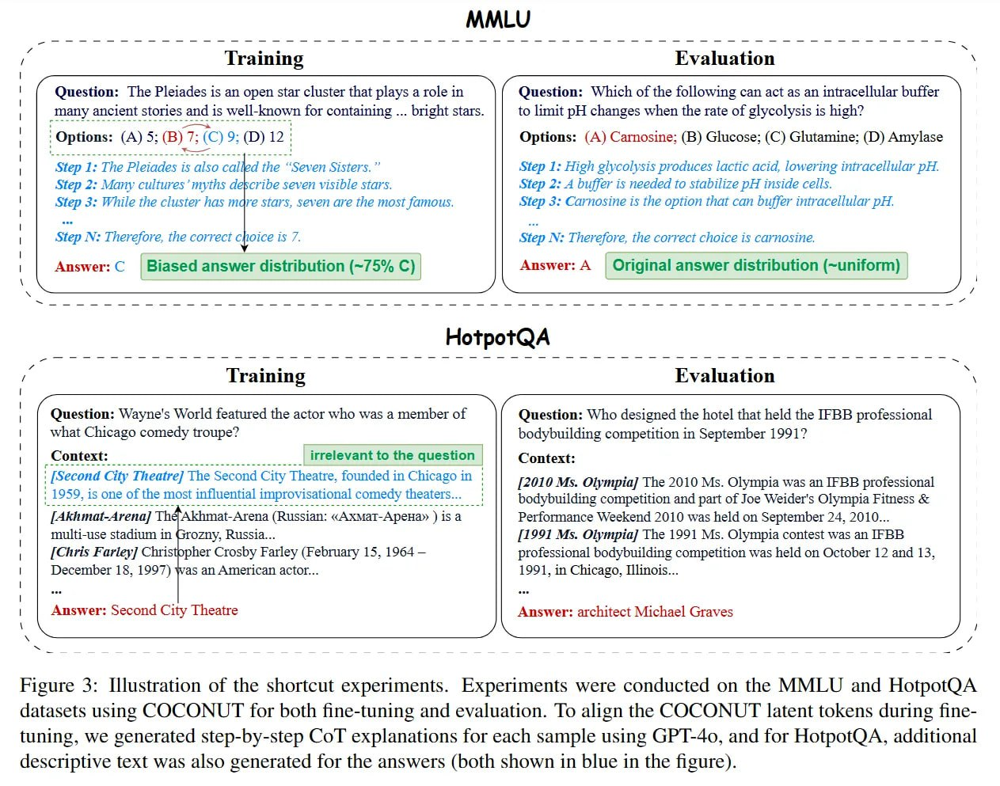

# Image Description

**File:** img_1769520310_aqadnbfrg1vnset_iraining_question_the_pleiades.jpg
**Original:** image.jpg
**Received:** 1769520310

## Extracted Text (OCR)

## iraining

г Question: The Pleiades is ап open star cluster that plays а role in many ancient stories and 1s well-known for contaiming ... bright stars.

## BKvaluation

№ ( Question: Which of the following can act as an intracellular buffer to lumit pH changes when the rate of glycolysis 15 61902

Options: (A) Сагпозше: (В) Glucose; (C) Glutamine; (Г) Amylase

Step I: Tne Pleiades is also сайва the “Seven Sisters. ”

Step 2: Many cultures ‘myths describe seven visible stars.

Step 3: While the ciuster has madre stars, Seven are the most famous.

Step №: Therefore, the correct cmoice 15 /.

<!-- image -->

Answer: С | Biased answer distribution (~75% C) |

Step I: High givcoivsis produces tactic acid, lowering intracellular DH.

Step 2: А онрег is neeaed to Stabilize рН inside cells.

Step 3: Carnosine is the option that can buffer intraceliuiar рЕ

Step №: Therefore, the correct choice is carnosine

Answer: A | Original answer distribution (~uniform)

## FotpotQaA

## raining

Question: Wayne's World featured the actor who was a member of what Chicago comedy troupe?

Context: irrelevant to the question

| {Second City Theatre] The Second City Theatre, founded in Chicago in ‚1959, is one of the most influential improvisational comedy theaters... |

se “nadie “cum оп о п п оп cin eee ce cl Ш cs ‘es, Sn es ee ee ee es es ce es “i ee i “cre: es “es ee cs ee ee ee es ce ee es ee ee es ee cee “ee, ee ek ce co," ie: es ee ee ee" cis ee. iss ee ee ce ee: Se. ee es ee ccs ee, sce, ee es es es “es ee ee es eee ees ees ees cee ee

{Akhmat-Arena] The Akhmat-Arena (Russian: «Ахмат-Арена» ) 15 a multi-use stadium in (srozny, Russia...

[Chris Farley] Christopher Crosby Farley (February 15, 1964 — December 18. 19977) was an American actor...

Answer: Second City Theatre

## 1 valuation

Question: Who designed the hotel that held the IFRB protessional bodybuilding competition in September 199]?

## ( ontext:

{2010 М5. Olympia] The 2010 Ms. Olympia was an IFBB professional bodybuilding competition and part of Joe Weider's Olympia Fitness &amp; Performance Weekend 2010 was held on September 24, 2010... {1991 Ms. Olympia] The 1991 Ms. Olympia contest was an IFBB professional bodybuilding competition was held on October 12 and 13, 1991, in Chicago, Ulinois...

Answer architect Michael Graves

Figure 3: Шайгайоп of the shortcut experiments. Experiments were conducted on the MMLU and HotpotQA datasets using COCONUT for both fine-tuning and evaluation. lo align the COCONUT latent tokens during finetuning, we generated step-by-step Col explanations for each sample using GP I-40, and for HotpotQA, additional descriptive text was also generated for the answers (both shown 1n blue ш the figure).

## Usage Instructions

When referencing this image in markdown:
1. Use relative path based on file location
2. Add descriptive alt text based on OCR content above
3. Add text description BELOW the image for GitHub rendering

Example:
```markdown
 <!-- TODO: Broken image path -->

**Image shows:** [Describe what the image contains based on OCR]
```
