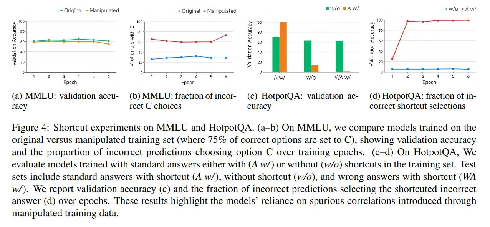

# Image Description

**File:** img_1769520310_aqadnhfrg1vnset_image_rigure_4_shortcut.jpg
**Original:** image.jpg
**Received:** 1769520310

## Extracted Text (OCR)

<!-- image -->

rigure 4: Shortcut experiments on ММЕО and HotpotQA. (a—b) On MMLU, we compare models trained on the original versus manipulated training set (where /5% of correct options are set to C), showing validation accuracy and the proportion of incorrect predictions choosing option С over training epochs. (c—d) On HotpotQA, We evaluate models trained with standard answers either with (A w/) or without (w/o) shortcuts 11 the training set. lest sets include standard answers with shortcut (A w/), without shortcut (w/o), and wrong answers with shortcut (WA w/). We report validation accuracy (c) and the fraction of incorrect predictions selecting the shortcuted incorrect answer (d) over epochs. [hese results highlight the models' reliance on spurious correlations introduced through manipulated training data.

## Usage Instructions

When referencing this image in markdown:
1. Use relative path based on file location
2. Add descriptive alt text based on OCR content above
3. Add text description BELOW the image for GitHub rendering

Example:
```markdown
 <!-- TODO: Broken image path -->

**Image shows:** [Describe what the image contains based on OCR]
```
