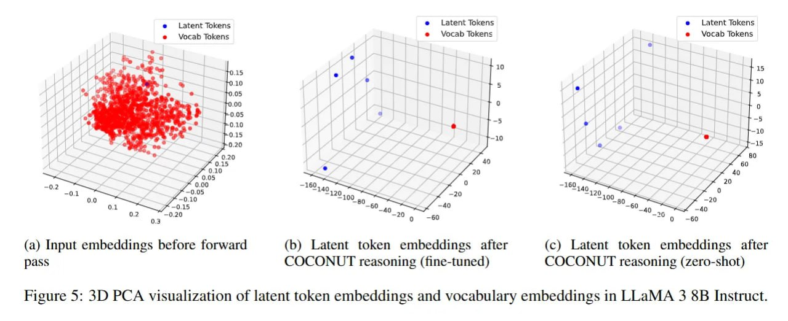

# Image Description

**File:** img_1769520310_aqadnxfrg1vnset_rigure_5_20_pca_visualization_of.jpg
**Original:** image.jpg
**Received:** 1769520310

## Extracted Text (OCR)

rigure 5: 20 PCA visualization of latent token embeddings and vocabulary embeddings in LLaMA 3 8B Instruct.

<!-- image -->

## Usage Instructions

When referencing this image in markdown:
1. Use relative path based on file location
2. Add descriptive alt text based on OCR content above
3. Add text description BELOW the image for GitHub rendering

Example:
```markdown
 <!-- TODO: Broken image path -->

**Image shows:** [Describe what the image contains based on OCR]
```
