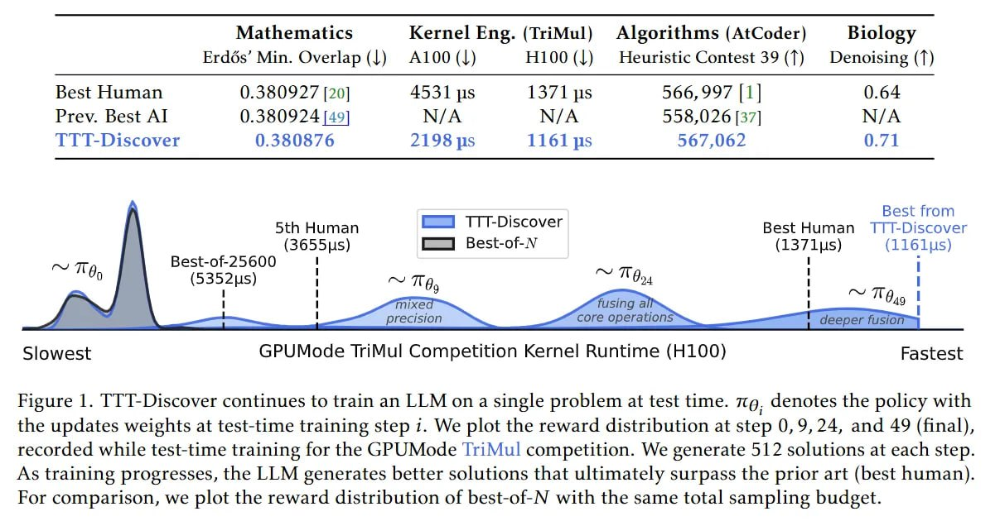

# Image Description

**File:** img_1769594208_aqadvrbrgwetyet_mathematics_kernel_eng_trimul.jpg
**Original:** image.jpg
**Received:** 1769594208

## Extracted Text (OCR)

|                                                            | Mathematics Kernel Eng. (TriMul) Algorithms (AtCoder) Biology Erdés’ Min. Overlap (1) A100 (J) H100({) Heuristic Contest 39(T) Denoising (T)   |
|------------------------------------------------------------|------------------------------------------------------------------------------------------------------------------------------------------------|
| Best Human 0.380927 [20] 4531 ps 1371 ps 566,997 | 1] 0.64 |                                                                                                                                                |
| Prev. Best Al 0.380924 [49] N/A N/A 558,026 [37] N/A       |                                                                                                                                                |
| TT I-Discover 0.380876 2198 ps 1161 ps 567,062 0.71        |                                                                                                                                                |

Figure 1. TT'I-Discover continues to train ап LLM on a single problem at test time. по. denotes the policy with the updates weights at test-time training step 1. We plot the reward distribution at step 0,9, 24, and 49 (final), recorded while test-time training for the GPUMode Ти Мы! competition. We generate 512 solutions at each step. As training progresses, the LLM generates better solutions that ultimately surpass the prior art (best human). For comparison, we plot the reward distribution of best-of-N with the same total sampling budget.

<!-- image -->

## Usage Instructions

When referencing this image in markdown:
1. Use relative path based on file location
2. Add descriptive alt text based on OCR content above
3. Add text description BELOW the image for GitHub rendering

Example:
```markdown
 <!-- TODO: Broken image path -->

**Image shows:** [Describe what the image contains based on OCR]
```
