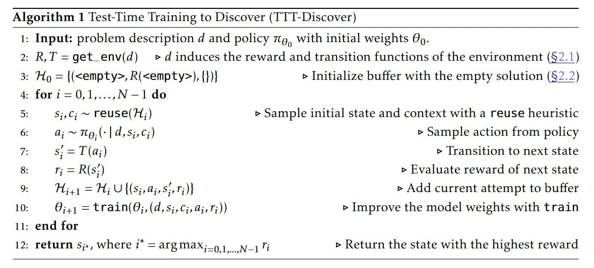

# Image Description

**File:** img_1769594208_aqadwbbrgwetyet_algorithm_1_test_lime_training_to.jpg
**Original:** image.jpg
**Received:** 1769594208

## Extracted Text (OCR)

## Algorithm 1 Test-lime Training to Discover (TT I-Discover)

- 1: Input: problem description 4 and policy по, with initial weights 6.
- 2: R,T =get\_env(d) га induces the reward and transition functions of the environment (52.1)

3: Hg = {(&lt;empty&gt;, R(&lt;empty&gt;), 1} | &gt; Initialize buffer with the empty solution (§2.2)

<!-- formula-not-decoded -->

5:

5;

irc

~ reuse(H;)

&gt; Sample initial state and context with a reuse heuristic

a;~Itg,\- | 9,5, С;) &gt; Sample action from policy

&gt; Transition to next state

8:

г; = R(s;)

&gt; Evaluate reward of next state

- ТЕ = Ty VAS Gp г] &gt; Add current attempt to buffer

10:

0:1 = train(6;,(d,5s;,Cj,a;,1;))

&gt; Improve the model weights with train

11: end tor

- 12: return sj, where?’ =argmax;\_), ми &gt; Return the state with the highest reward

## Usage Instructions

When referencing this image in markdown:
1. Use relative path based on file location
2. Add descriptive alt text based on OCR content above
3. Add text description BELOW the image for GitHub rendering

Example:
```markdown
 <!-- TODO: Broken image path -->

**Image shows:** [Describe what the image contains based on OCR]
```
