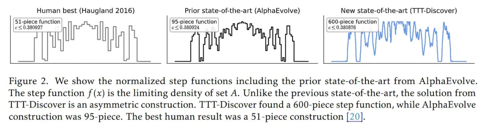

# Image Description

**File:** img_1769594208_aqadwhbrgwetyet_image_figure_2_we.jpg
**Original:** image.jpg
**Received:** 1769594208

## Extracted Text (OCR)

<!-- image -->

Figure 2. We show the normalized step functions including the prior state-of-the-art from AlphaEvolve. The step function f(x) is the limiting density of set A. Unlike the previous state-of-the-art, the solution from TTT-Discover is an asymmetric construction. TTT-Discover found a 600-piece step function, while AlphaEvolve construction was 95-piece. The best human result was a 51-piece construction [20].

## Usage Instructions

When referencing this image in markdown:
1. Use relative path based on file location
2. Add descriptive alt text based on OCR content above
3. Add text description BELOW the image for GitHub rendering

Example:
```markdown
 <!-- TODO: Broken image path -->

**Image shows:** [Describe what the image contains based on OCR]
```
