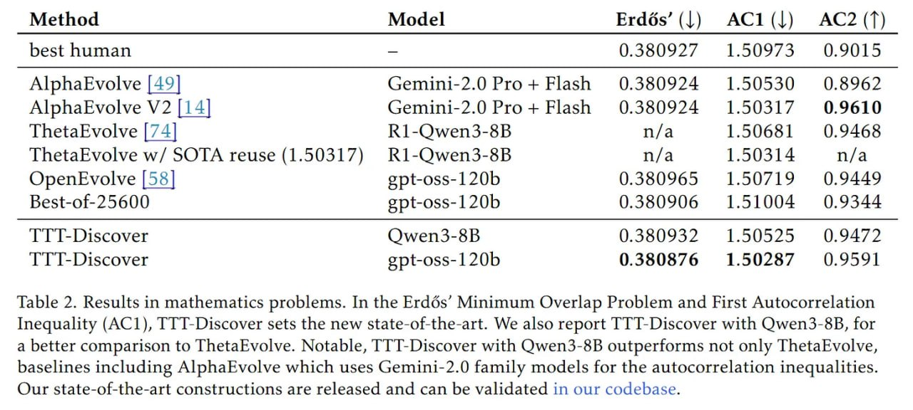

# Image Description

**File:** img_1769594208_aqadwrbrgwetyet_method_model_erdes_21.jpg
**Original:** image.jpg
**Received:** 1769594208

## Extracted Text (OCR)

| Method Model Erdés’ (|) 2АС1(]) AC2(T)                                                                                                                                                                                                                                                                                                                     |
|------------------------------------------------------------------------------------------------------------------------------------------------------------------------------------------------------------------------------------------------------------------------------------------------------------------------------------------------------------|
| hest human = 0.380927 150973 09015                                                                                                                                                                                                                                                                                                                         |
| AlphaEvolve [49] Gemini-2.0 Pro+ Flash 0.380924 1.50530 0.8962 AlphaEvolve V2 |14] Gemini-2.0 Рго + Flash 0.380924 1.50317 0.9610 ThetaEvolve [74] R1-Qwen3-8B n/a 1.50681 0.9468 ThetaEvolve w/ SOTA reuse (1.50317) R1l-Qwen3-8B n/a 1.50314 n/a OpenEvolve |58| gpt-oss-120b 0.380965 1.50719 0.9449 Best-of-25600 gpt-oss-120b 0.380906 1.51004 0.9344 |
| TTT-Discover Owen3-8B 0.380932 1.50525 0.9472                                                                                                                                                                                                                                                                                                              |
| TTT-Discover gpt-oss-120b 0.380876 1.50287 0.9591                                                                                                                                                                                                                                                                                                          |

Table 2. Results in mathematics problems. In the Erdés' Minimum Overlap Problem and First Autocorrelation Inequality (AC1), TTT-Discover sets the new state-of-the-art. We also report TTT-Discover with Qwen3-8B, for a better comparison to ThetaEvolve. Notable, ТТТ-О15соуег with Qwen3-8B outperforms not only ThetaEvolve, baselines including AlphaEvolve which uses Gemini-2.0 family models for the autocorrelation inequalities. Our state-of-the-art constructions are released and can be validated in our codebase.

## Usage Instructions

When referencing this image in markdown:
1. Use relative path based on file location
2. Add descriptive alt text based on OCR content above
3. Add text description BELOW the image for GitHub rendering

Example:
```markdown
 <!-- TODO: Broken image path -->

**Image shows:** [Describe what the image contains based on OCR]
```
