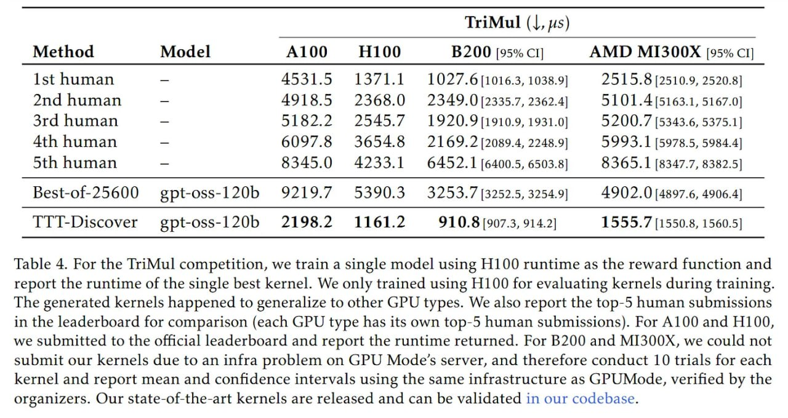

# Image Description

**File:** img_1769594208_aqadwxbrgwetyet_trimul_j_ys_trimul.jpg
**Original:** image.jpg
**Received:** 1769594208

## Extracted Text (OCR)

| TriMul (J, ys)   | TriMul (J, ys)                                                                           | TriMul (J, ys)   | TriMul (J, ys)   |
|------------------|------------------------------------------------------------------------------------------|------------------|------------------|
|                  | Method Model A100 Н100 В200 [95% cl] AMD MI300X [95% ci                                  |                  |                  |
|                  | Ist human — 4531.5 1371.1 1027.61016.3, 1038.9] 2515.8 [2510.9, 2520.3]                  |                  |                  |
|                  | 2nd human — 4918.5 2368.0 2349.0[2335.7, 2362.4] 5101.4[5163.1, 5167.0]                  |                  |                  |
|                  | 3rd human _ 5182.2 2545.7 1920.9{1910.9, 1931.0] 5200.7 [5343.6, 5375.1]                 |                  |                  |
|                  | 4th human _ 6097.8 3654.8 2169. 21[2089.4, 2248.9] 5993.1 [5978.5, 5984.4]               |                  |                  |
|                  | 5th human _ 8345.0 4233.1 6452.1 [6400.5, 6503.8] 8365.1 (8347.7, 8382.5]                |                  |                  |
|                  | Best-of-25600 gpt-oss-120b 9219.7 5390.3 3253.7 (3252.5, 3254.9] 4902.0 (4897.6, 4906.4] |                  |                  |
|                  | TYI-Discover gpt-oss-120b 2198.2 1161.2 910.8 [907.3, 914.2] 1555.7 [1550.8, 1560.5]     |                  |                  |

Table 4. For the TriMul competition, we train a single model using H100 runtime as the reward function and report the runtime of the single best kernel. We only trained using H100 for evaluating kernels during training. The generated kernels happened to generalize to other GPU types. We also report the top-5 human submissions in the leaderboard for comparison (each GPU type has its own top-5 human submissions). For А100 and H100, we submitted to the official leaderboard and report the runtime returned. For B200 and MI300X, we could not submit our kernels due to an infra problem on GPU Modes server, and therefore conduct 10 trials for each kernel and report mean and confidence intervals using the same infrastructure as GPUMode, verified by the organizers. Our state-of-the-art kernels are released and can be validated in our codebase.

## Usage Instructions

When referencing this image in markdown:
1. Use relative path based on file location
2. Add descriptive alt text based on OCR content above
3. Add text description BELOW the image for GitHub rendering

Example:
```markdown
 <!-- TODO: Broken image path -->

**Image shows:** [Describe what the image contains based on OCR]
```
