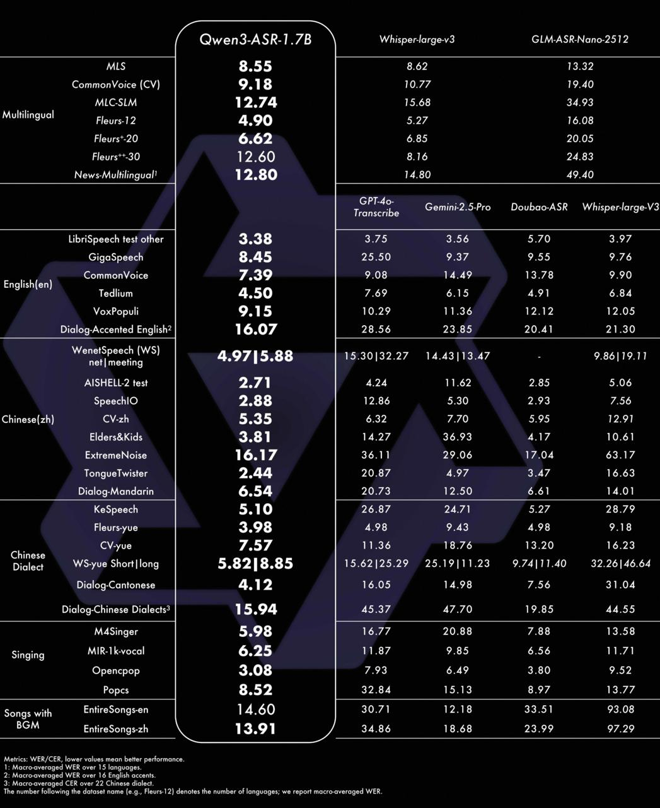

# Image Description

**File:** img_1769745257_aqadta9rg9l4ut_wen3_asr.jpg
**Original:** image.jpg
**Received:** 1769745257

## Extracted Text (OCR)

|              |                                                                                   | (wen3-ASR-]/                      |                                                                                                                          |
|--------------|-----------------------------------------------------------------------------------|-----------------------------------|--------------------------------------------------------------------------------------------------------------------------|
| Multilingual | CommonVoice (CV] Flagret 20 [г *+.30 News-Multilingual!                           | 8.55 4.90 6.62                    | Whisper-large-v3 GLM-ASR-Nano-2512 5 oF 8 16 Я Gemini-2.5-Pro  ПоиБао-АЗВ — \У/Н5рег4агде УЗ                             |
| Englishien}  | LibriSpeech test other GigaSpeech CommonvVoice VoxPopuli Dialog-Accented English? | 7.39                              | 3.75 3.56 5 70 397 9 55  о 76 11.36  1? 17?  17 05 723.85  ?  0.41  21.30                                                |
|              | WenetSpeech (WS) net| meeting ELL-/ test SpeechlO CV-zh                           | 4.9715.88                         | ~=15.30/32.27 14.43|/13.4/7 - 9.8619. 11                                                                                 |
| Chinese(zh}  | Flders& Kids FxytremeNoise Tongue! wister Dialog-Mandarin                         | 2? 88 5.35 3.8 1] 16.17 6.54 5.10 | 5 30  7 56 6.37  го Al? 6.4]  140]                                                                                       |
| Chinese      | KeSpeech Fleurs-yue CV-yue WS-yue Short|long Dialog-Cantonese                     | 4.57 5.8218.85                    | 5 У A OB 9 АЗ 498 9 18 11.36 18.76 13.20 16.23 19.621259.297 25.19) 11.23 9./4|/11.40 32.20|46.64 14.05 14 98 7 56 31 04 |
| пая          | M4singer Opencpop Popcs                                                           | 5.98 3.52                         | 15 77 6.56 6.49 a? НА                                                                                                    |
| Songs with   | EntireSongs-en EntireSongs-zh                                                     |                                   | 30 ./ 1]  12.18  33.5]                                                                                                   |

Metrics: WER/CER, lower values mean better pertormance.

1: Macro-overaged WER over 15 languages.

2: Macro-overaged WER over 16 English occents.

J: Macro-averaged CER over 22 Chinese dialect.

The number tollowing the dataset name [e.g., Fleurs-12) denotes the number of languoges; we report mocro-overoged WER.

## Usage Instructions

When referencing this image in markdown:
1. Use relative path based on file location
2. Add descriptive alt text based on OCR content above
3. Add text description BELOW the image for GitHub rendering

Example:
```markdown
 <!-- TODO: Broken image path -->

**Image shows:** [Describe what the image contains based on OCR]
```
