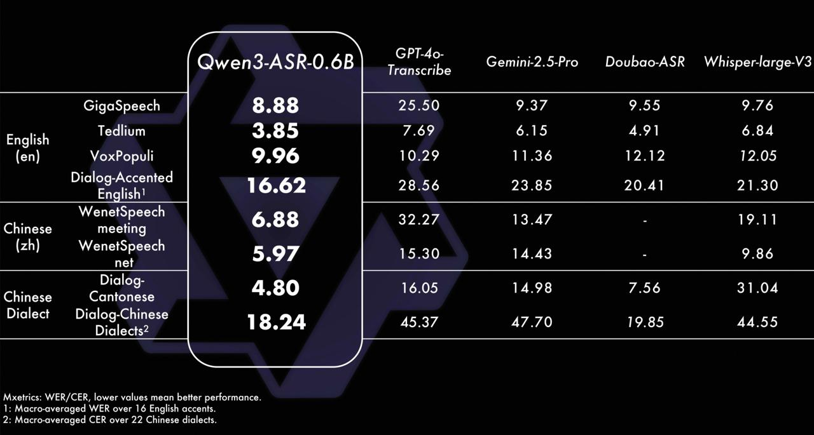

# Image Description

**File:** img_1769745258_aqadtg9rg9l4ut_qwen3_asr_0_6b_transcribe_dnoubao_asr.jpg
**Original:** image.jpg
**Received:** 1769745258

## Extracted Text (OCR)

| Qwen3-ASR-0.6B                                     | Transcribe   | DNoubao-ASR   | Whisper-large-V3   |
|----------------------------------------------------|--------------|---------------|--------------------|
| GigaSpeech | 3.88                                  |              |               |                    |
| English Tedlium | 3.85                             |              | AD]           | 6 ВА               |
| (en) VoxPopuli | 9.96                              |              |               | 1905               |
| Dialog-Accented 16.62  Enalish!                    |              |               |                    |
| WenetSpeech 6.88  Chinese meeting                  |              |               |                    |
| (zh) WenetSpeech  =. в                             |              |               |                    |
| Dialog- | 4.80  Chinese Cantonese  =e. | ыы р ый = | 146.05       | 7 56          |                    |
| Dialect Dialog-Chinese 18.24  Dialects?            |              | 19.85         |                    |

## Usage Instructions

When referencing this image in markdown:
1. Use relative path based on file location
2. Add descriptive alt text based on OCR content above
3. Add text description BELOW the image for GitHub rendering

Example:
```markdown
 <!-- TODO: Broken image path -->

**Image shows:** [Describe what the image contains based on OCR]
```
