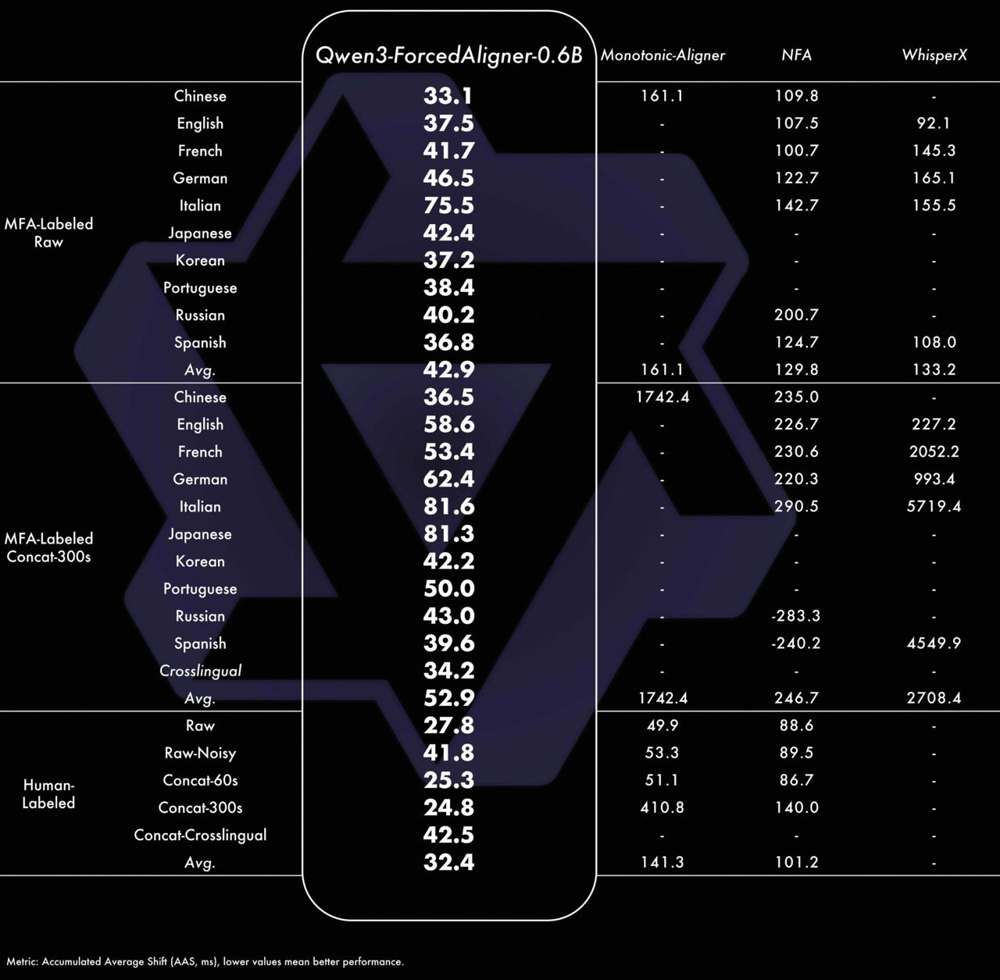

# Image Description

**File:** img_1769745258_aqadtw9rg9l4ut_qwen3_forcedaligner_0_6b_monotonic_align.jpg
**Original:** image.jpg
**Received:** 1769745258

## Extracted Text (OCR)

| Qwen3-ForcedAligner-0.6B \ Monotonic-Aligner NFA WhisperX Chinese ие 4 | | 161.1 109.8 English | м УД | - 107.5 92.1 French | 4ii sf | - 100.7 145 3 (serman Trellfelal ть We | | - 1427 155 5 MFA-Labeled 42.4  Raw Japanese К огеап Portuguese WO. Russian | 4&4). 7 ] - ОО Spanish | 306.6 | - 124.7 108.0 Avg.  42.9  161.1  129.8  133.2 Chinese | 246.5 1742.4 . 235.0   |                          |
|--------------------------------------------------------------------------------------------------------------------------------------------------------------------------------------------------------------------------------------------------------------------------------------------------------------------------------------------------------------------------------|--------------------------|
| French | &.4 д ] - 230.6 2052.2                                                                                                                                                                                                                                                                                                                                                |                          |
| (serman                                                                                                                                                                                                                                                                                                                                                                        |                          |
| Italian м1 & | . 290.5 5719.4                                                                                                                                                                                                                                                                                                                                                  |                          |
| MFA-Labeled Japanese Эт. 3                                                                                                                                                                                                                                                                                                                                                     |                          |
| Concat-300s Когеап A9. 9                                                                                                                                                                                                                                                                                                                                                       |                          |
| Portuguese JU.U                                                                                                                                                                                                                                                                                                                                                                |                          |
| Russian                                                                                                                                                                                                                                                                                                                                                                        |                          |
| Spanish | э2Уу.О | - -240.2 4549.9                                                                                                                                                                                                                                                                                                                                             |                          |
| Crosslingual | 04.2                                                                                                                                                                                                                                                                                                                                                            |                          |
| Avg.  54.9  42.4  246./  2708.4                                                                                                                                                                                                                                                                                                                                                |                          |
| Raw-Noisy | 41.6 | 23.3 89.5                                                                                                                                                                                                                                                                                                                                                   |                          |
| Нитап- Concat-60s 23-9 | 51.1 86./ Labeled Concat-300s 5A 2 | 410 8 140.0                                                                                                                                                                                                                                                                                                      |                          |
| Concat-Crosslingual  42.)                                                                                                                                                                                                                                                                                                                                                      |                          |
|                                                                                                                                                                                                                                                                                                                                                                                | Avg.  ae |  141.3  1Q1.2 |

## Usage Instructions

When referencing this image in markdown:
1. Use relative path based on file location
2. Add descriptive alt text based on OCR content above
3. Add text description BELOW the image for GitHub rendering

Example:
```markdown
 <!-- TODO: Broken image path -->

**Image shows:** [Describe what the image contains based on OCR]
```
