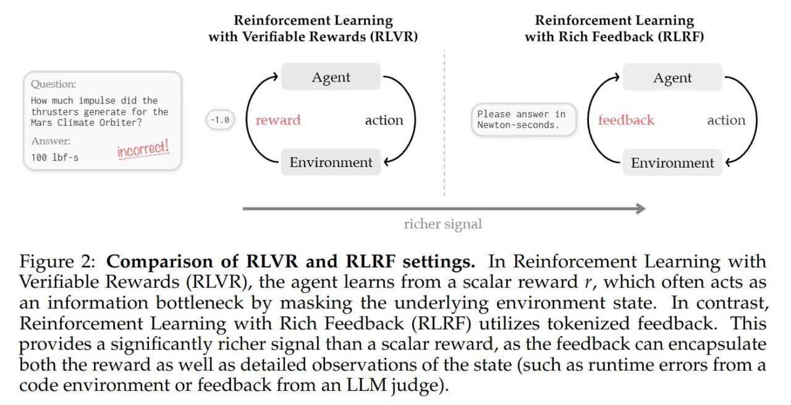

# Image Description

**File:** img_1770036024_aqadfw5rg07jut_figure_2_comparison_of_rlvr_and.jpg
**Original:** image.jpg
**Received:** 1770036024

## Extracted Text (OCR)

Figure 2: Comparison of RLVR and ВЕКЕ settings. In Reinforcement Learning with Verifiable Rewards (RLVR), the agent learns from a scalar reward r, which often acts as an information bottleneck by masking the underlying environment state. In contrast, Reinforcement Learning with Rich Feedback (RLRF) utilizes tokenized feedback. This provides a significantly richer signal than a scalar reward, as the feedback can encapsulate both the reward as well as detailed observations of the state (such as runtime errors from a code environment or feedback from an LLM judge).

<!-- image -->

## Usage Instructions

When referencing this image in markdown:
1. Use relative path based on file location
2. Add descriptive alt text based on OCR content above
3. Add text description BELOW the image for GitHub rendering

Example:
```markdown
 <!-- TODO: Broken image path -->

**Image shows:** [Describe what the image contains based on OCR]
```
