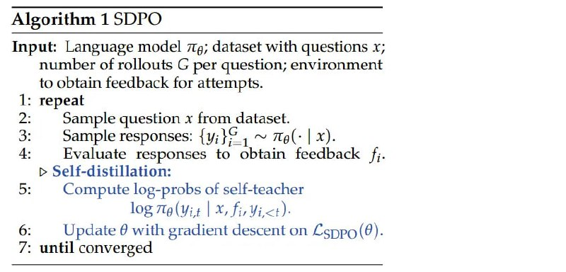

# Image Description

**File:** img_1770036024_aqadga5rg07jut9_algorithm_1_sdpo_input_language.jpg
**Original:** image.jpg
**Received:** 1770036024

## Extracted Text (OCR)

## Algorithm 1 SDPO

Input: Language model ла; dataset with questions x; number of rollouts G per question; environment to obtain feedback for attempts.

- repeat
- Sample question x from dataset.
- Sample responses: {y;}%\_, ~ пе. | x).
- Evaluate responses to obtain feedback fj.
- Compute log-probs of self-teacher
- log 7ta(Yit | X, fi, Vict).
- 6:

Update @ with gradient descent оп Coppo(@).
- 7: until converged

## Usage Instructions

When referencing this image in markdown:
1. Use relative path based on file location
2. Add descriptive alt text based on OCR content above
3. Add text description BELOW the image for GitHub rendering

Example:
```markdown
 <!-- TODO: Broken image path -->

**Image shows:** [Describe what the image contains based on OCR]
```
