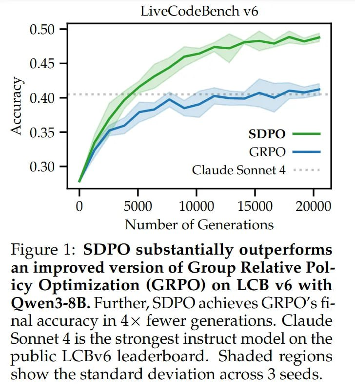

# Image Description

**File:** img_1770036024_aqadhg5rg07jut9_figure_1_sdpo_substantially_outperforms_.jpg
**Original:** image.jpg
**Received:** 1770036024

## Extracted Text (OCR)

Figure 1: SDPO substantially outperforms an improved version of Group Relative Policy Optimization (GRPO) on LCB v6 with OQwen3-8B. Further, SDPO achieves GRPO'''s Нnal accuracy т 4х fewer generations. Claude Sonnet 4 is the strongest instruct model on the public LCBv6 leaderboard. Shaded regions show the standard deviation across 3 seeds.

<!-- image -->

## Usage Instructions

When referencing this image in markdown:
1. Use relative path based on file location
2. Add descriptive alt text based on OCR content above
3. Add text description BELOW the image for GitHub rendering

Example:
```markdown
 <!-- TODO: Broken image path -->

**Image shows:** [Describe what the image contains based on OCR]
```
