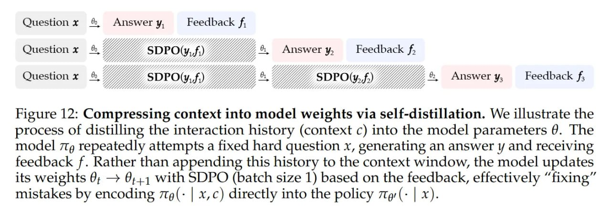

# Image Description

**File:** img_1770036024_aqadka5rg07jut_figure_12_compressing_context_into_model.jpg
**Original:** image.jpg
**Received:** 1770036024

## Extracted Text (OCR)

Figure 12: Compressing context into model weights via self-distillation. We illustrate the process of distilling the interaction history (context с) into the model parameters @. The model лу repeatedly attempts a fixed hard question x, generating an answer у and receiving feedback f. Rather than appending this history to the context window, the model updates its weights 6; — @:,1 with SDPO (batch size 1) based on the feedback, effectively "fixing" mistakes by encoding 7t@(- | x,c) directly into the policy 7tg(- | x).

<!-- image -->

## Usage Instructions

When referencing this image in markdown:
1. Use relative path based on file location
2. Add descriptive alt text based on OCR content above
3. Add text description BELOW the image for GitHub rendering

Example:
```markdown
 <!-- TODO: Broken image path -->

**Image shows:** [Describe what the image contains based on OCR]
```
