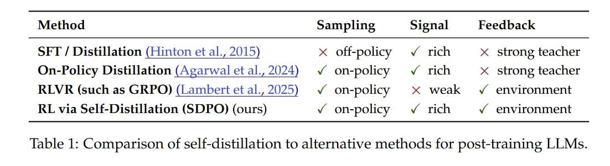

# Image Description

**File:** img_1770036024_aqadkg5rg07jut_table_1_comparison_of_self_distillation_.jpg
**Original:** image.jpg
**Received:** 1770036024

## Extracted Text (OCR)

Table 1: Comparison of self-distillation to alternative methods for post-training LLMs.

|                                                                                                                                                                                                                                                                                                                     | Method Sampling Signal Feedback   |
|---------------------------------------------------------------------------------------------------------------------------------------------------------------------------------------------------------------------------------------------------------------------------------------------------------------------|-----------------------------------|
| SFT / Distillation (Hinton et al., 2015) x off-policy Vv rich х strong teacher On-Policy Distillation (Agarwal et al., 2024) у оп-ройсу v rich x strong teacher RLVR (such as GRPQO) (Lambert etal, 2025) Vv on-policy x weak у environment RL via Self-Distillation (SDPQ) (ours) и“ оп-ройсу v rich ¥ environment |                                   |

## Usage Instructions

When referencing this image in markdown:
1. Use relative path based on file location
2. Add descriptive alt text based on OCR content above
3. Add text description BELOW the image for GitHub rendering

Example:
```markdown
 <!-- TODO: Broken image path -->

**Image shows:** [Describe what the image contains based on OCR]
```
