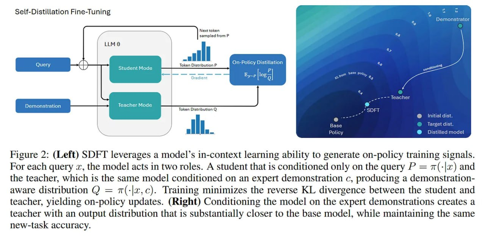

# Image Description

**File:** img_1770036072_aqadmatrg07jauh_figure_2_left_leverages_a.jpg
**Original:** image.jpg
**Received:** 1770036072

## Extracted Text (OCR)

Figure 2: (Left) ЗОНТ leverages a model's 1n-context learning ability to generate on-policy training signals. For each query x, the model acts in two roles. A student that is conditioned only on the query P = z(-|a) and the teacher, which is the same model conditioned on an expert demonstration c, producing a demonstrationaware distribution С) = z(-|x,c). Training minimizes the reverse KL divergence between the student and teacher, yielding on-policy updates. (Right) Conditioning the model on the expert demonstrations creates a teacher with an output distribution that is substantially closer to the base model, while maintaining the same new-task accuracy.

<!-- image -->

## Usage Instructions

When referencing this image in markdown:
1. Use relative path based on file location
2. Add descriptive alt text based on OCR content above
3. Add text description BELOW the image for GitHub rendering

Example:
```markdown
 <!-- TODO: Broken image path -->

**Image shows:** [Describe what the image contains based on OCR]
```
