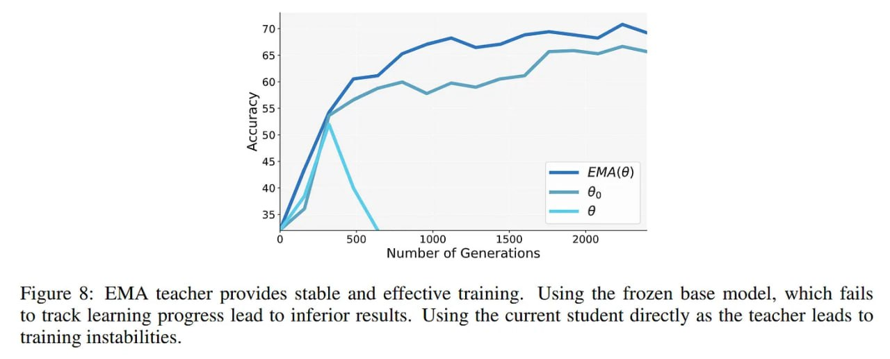

# Image Description

**File:** img_1770036072_aqadmgtrg07jauh_figure_8_ema_teacher_provides_stable.jpg
**Original:** image.jpg
**Received:** 1770036072

## Extracted Text (OCR)

Figure 8: EMA teacher provides stable and effective training. Using the frozen base model, which fails to track learning progress lead to inferior results. Using the current student directly as the teacher leads to training instabilities.

<!-- image -->

## Usage Instructions

When referencing this image in markdown:
1. Use relative path based on file location
2. Add descriptive alt text based on OCR content above
3. Add text description BELOW the image for GitHub rendering

Example:
```markdown
 <!-- TODO: Broken image path -->

**Image shows:** [Describe what the image contains based on OCR]
```
