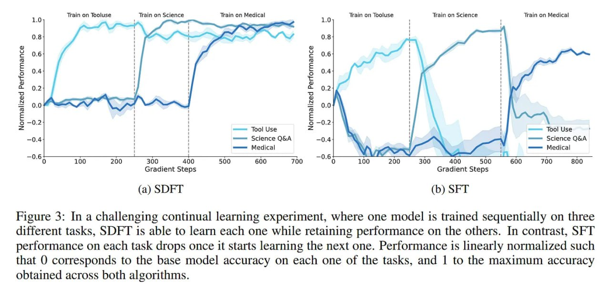

# Image Description

**File:** img_1770036072_aqadmwtrg07jauh_figure_3_in_a_challenging_continual.jpg
**Original:** image.jpg
**Received:** 1770036072

## Extracted Text (OCR)

Figure 3: In a challenging continual learning experiment, where one model 1$ trained sequentially on three different tasks, SDFT 1s able to learn each one while retaining performance on the others. In contrast, SFT performance on each task drops once it starts learning the next one. Performance 1$ linearly normalized such that 0 corresponds to the base model accuracy on each one of the tasks, and | to the maximum accuracy obtained across both algorithms,

<!-- image -->

## Usage Instructions

When referencing this image in markdown:
1. Use relative path based on file location
2. Add descriptive alt text based on OCR content above
3. Add text description BELOW the image for GitHub rendering

Example:
```markdown
 <!-- TODO: Broken image path -->

**Image shows:** [Describe what the image contains based on OCR]
```
