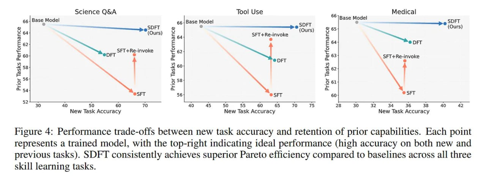

# Image Description

**File:** img_1770036072_aqadnatrg07jauh_figure_4_performance_trade_offs_between_.jpg
**Original:** image.jpg
**Received:** 1770036072

## Extracted Text (OCR)

Figure 4: Performance trade-offs between new task accuracy and retention of prior capabilities. Each point represents a trained model, with the top-right indicating ideal performance (high accuracy on both new and previous tasks). SDFT consistently achieves superior Pareto eificiency compared to baselines across all three skill learning tasks.

<!-- image -->

## Usage Instructions

When referencing this image in markdown:
1. Use relative path based on file location
2. Add descriptive alt text based on OCR content above
3. Add text description BELOW the image for GitHub rendering

Example:
```markdown
 <!-- TODO: Broken image path -->

**Image shows:** [Describe what the image contains based on OCR]
```
